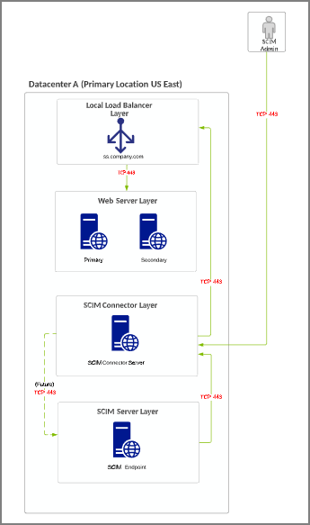
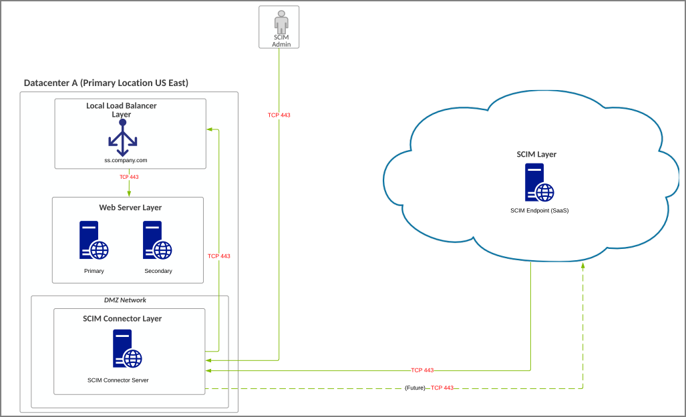
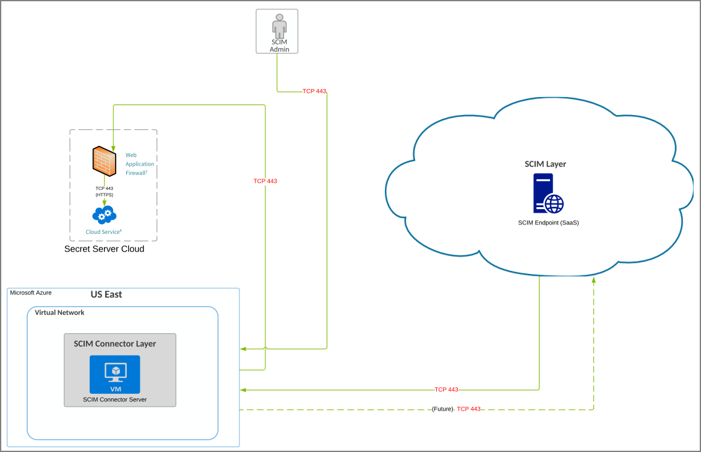
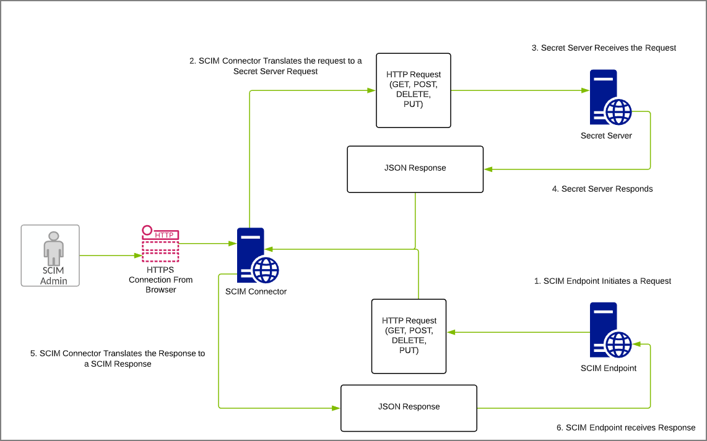

[title]: # (Architecture for SCIM 2.5)
[tags]: # (architecture)
[priority]: # (207)
# Architecture for SCIM 2.5

This reference architecture is our best practice architecture/design for Thycotic Secret Server leveraging SCIM 2.5. We have
provided high level communication requirements, which does not include Secret Server component specific communication.
These variations can be combined with either Secret Server or Secret Server Cloud.

Below is a high level summary of the design variations:

* SS-SCIM-REF#01 - A-1 - SS On Prem + SCIM
* SS-SCIM-REF#01 - A-2 - SS On Prem + SCIM (Perimeter Network)
* SS-SCIM-REF#01 - B-1 - SSC + SCIM
* SS-SCIM-REF#01 - C-1 - Request Communication Flow

## Definitionsfor SS-SCIM-REF#01 - A-1

* Customer isusing an on-premise installation of Secret Server installed in an on premise location with a
dedicated system for the SCIM Connector. While the SCIM Connector can be installed on the same system as
Secret Server, this is not recommended for large production environments.
* The SCIM Server Layer is your 3rd party SCIM Server installed in an on-premise location (Examples include
Sailpoint IdentityIQ, PingIdentity, etc).

### Requirements for SS-SCIM-REF#01 - A-1

* Outbound communication from your SCIM Server to the SCIM Connector is required for integration.
* Outbound communication from your SCIM Connector to the SCIM Server is not required currently, but may be required in the future.
* While this diagram shows the default port for https (443), other ports may be leveraged between your SCIM.
Server and SCIM Connector and between your SCIM Connector and Secret Server.
* SCIM Connector System Requirements:
   * Windows Server 2012 R2+, Windows Server 2019
   * 4 Core CPU
   * 4 GB RAM

   

## Definitions for SS-SCIM-REF#01 - A-2

* Customer isusing an on-premise installation of Secret Server installed in an on premise location with a
dedicated system for the SCIM Connector. While the SCIM Connector can be installed on the same system as
Secret Server, this is not recommended for large production environments.
* The SCIM Server Layer is your 3rd party SCIM Server SaaS offering.

### Requirements for SS-SCIM-REF#01 - A-2

* Outbound communication from your SCIM Server to the SCIM Connector is required for integration.
* Outbound communication from your SCIM Connector to the SCIM Server is not required currently, but may be required in the future.
* It is recommended that your SCIM SaaS Server and your On Premise data center be located in a similar region, although the application can accomodate high latency.
* While this diagram showsthe default port for https (443), other ports may be leveraged between your SCIM Server and SCIM Connector and between your SCIM Connector and Secret Server.
* SCIM Connector System Requirements:
   * Windows Server 2012 R2+, Windows Server 2019
   * 4 Core CPU
   * 4 GB RAM

   

## Definitions for SS-SCIM-REF#01 - B-1

* Customer isusing SSC hosted in Azure with a dedicated system for the SCIM Connector installed in the customers Azure private cloud. SCIM Connector does not have an option to be installed on SSC application servers.
* The SCIM Server Layer is your 3rd party SCIM Server SaaS offering.

### Requirements for SS-SCIM-REF#01 - B-1

* Outbound communication from your SCIM Server to the SCIM Connector is required for integration.
* Outbound communication from your SCIM Connector to the SCIM Server is not required currently, but may be required in the future.
* It is recommended that your SCIM SaaS Server and your private cloud data center be located in a similar region, although the application can accomodate high latency. Azure is provided as an example, but any other private cloud vendor may be leveraged for installing the SCIM Connector.
* While this diagram shows the default port for https (443), other ports may be leveraged between your SCIM Server and SCIM Connector and between your SCIM Connector and Secret Server. SSC currently only uses port 443.
* SCIM 2.5 is required for integration with Secret Server Cloud
* WAF Inbound Firewall Requirements for SSCare:
   * Public IP is based on geographical location
      * IP Addresses for all regions: 45.60.38.37, 45.60.40.37, 45.60.32.37, 45.60.34.37, 45.60.36.37,45.60.104.36
* SCIM Connector System Requirements:
   * Windows Server 2012 R2+, Windows Server 2019
   * 4 Core CPU
   * 4 GB RAM

   

## SS-SCIM-REF#01 - C-1 - Request Communication Flow

  
