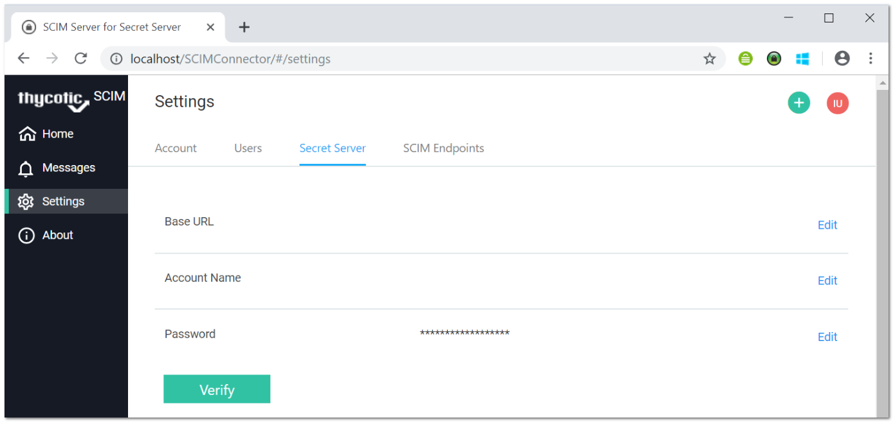

[title]: # (Secret Server Connection)
[tags]: # (connecting,configuration)
[priority]: # (201)
# Making a Secret Server Connection

1. In the SCIM Connector application, select the __Settings__ menu on the left.
1. Select the __Secret Server__ tab at the top of the page:

   
1. In the Secret Server __Base URL__ section:

   1. Click  the __Edit__ link.
   1. Type the URL for your SS instance. For example, `https://<ipaddress>/SecretServer/`.
   1. Click __OK__.
1. In the __Account Name__ section:

   1. Click the __Edit__ link.
   1. Type the user name for the account that was created above.
   1. Click __OK__.
1. In the __Password__ section:

   1. Click __Edit__ link.
   1. Type the password for the account that was created above.
   1. Click __OK__.
