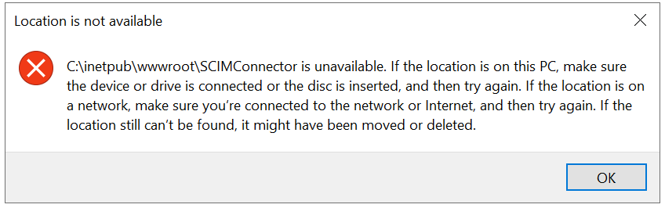

[title]: # (Known Issues and Error Messages)
[tags]: # (errors)
[priority]: # (205)
# Known Issues and Error Messages

## Known Issues

1. When the application account does not have permission to create folder at root level, and error is displayed “Folder already created at root level” and the SCIM Administrator can not save the Secret Server configuration options. To fix this, add the application account as an owner to the folder in Secret Server.

1. Occasionally when uninstalling and selecting delete settings file the system
    will lock the settings file throwing an error

   

   1. The SCIM Connector should be uninstalled but a few files may still be present on the machine. Locate the SCIM Connector folder that IIS was pointing to and delete it. This may require a restart of IIS

   1. If the SCIM Connector site or virtual directory is still present in IIS, right click on the site or virtual directory (IIS manager) and select “Remove”

## Error Messages

### Secret server Errors

* Secret Server service unavailable.

* Incorrect username or password.

* Secret required permission.

* SCIM connector secret was deleted. To recover the secret, contact your secret server admin.

* Request sent and approval pending.

* URL must be https.

* Login as administrator.

* SCIM folder was deleted. Contact your Secret Server admin to move the SCIM Secrets into the SCIM connector folder.

* Server folder path requires read write permission to configure SCIM connector.

* Invalid application account.

* Secret Server Not Configured.

* Connection Successful however Workflow must be enabled in Secret Server.

* Unable to update Configuration.

* Secret Server requires https URL.

* HTTPS connection is required for SCIM Connector.

* The provided URL is invalid.

* Secret Server is https enabled. Endpoint requires https URL.

* Endpoint name already exists and must be unique.

* SCIM Connector has been disabled. To re-enable SCIM Connector, correct any errors and uncheck the SCIM Connector Disabled checkbox.

* Secret Server Not HTTPS Enabled, you must enable https on Secret Server OR select Allow HTTP for SCIM Connector.

* Invalid Secret Server URL. Secret Server URL not found in setting.enc file.

* The request will not be sent to Secret Server. Too many failures and the error count has surpassed the error threshold. SCIM Connector has been disabled. Log into SCIM Connector and enable it once the Secret Server Errors have been resolved.

* Base URL should be without http or https method.

* Allow Http cannot be disabled until all endpoints are https. Make sure SCIM Connector is enabled to update an endpoint. Settings not saved.

* Secret Server is not configured for HTTPS. Configure HTTPS on Secret Server before continuing.

* Username required.

* Password required.

* BaseUrl required.

* Login failed with {BaseUrl}.

* Login does not have permission to access SCIM Connector. Contact SCIM Connector owner for access.

* Application account is missing a required permission.

* Secret Server password has expired.Please login to Secret Server to reset your password.

### SCIM Errors

* The specified filter syntax was invalid (does not comply with Figure 1), or the specified attribute and filter comparison combination is not supported.

* If you upgrade or reinstall SCIM Connector or change an endpoint from https to http in Secret Server, when you select the endpoint in SCIM Connector you will now see this error unless "allow http endpoint" is enabled.

* The specified filter yields many more results than the server is willing to calculate or process. For example, a filter such as \"(userName pr)\" by itself would return all entries with a \"userName\" and MAY not be acceptable to the service provider.

* One or more of the attribute values are already in use or are reserved.

* The attempted modification is not compatible with the target attribute's mutability or current state (e.g., modification of an \"immutable\" attribute with an existing value).

* The request body message structure was invalid or did not conform to the request schema.

* The `\"path\"` attribute was invalid or malformed.

* The specified \"path\" did not yield an attribute or attribute value that could be operated on. This occurs when the specified \"path\" value contains a filter that yields no match.

* A required value was missing, or the value specified was not compatible with the operation or attribute type or resource schema.

* The specified SCIM protocol version is not supported.

* The specified request cannot be completed, due to the passing of sensitive (e.g. personal) information in a request URI. For example, personal information SHALL NOT be transmitted over request URIs.

### SCIM Common Errors

* Attribute '{0}' is immutable and cannot be changed.

* Attribute '{0}' is required.

* Attribute '{0}' is readOnly.

* Attribute '{0}' MUST be unique.

* '{0}' not found or disabled.

* Resource '{0}' not found.

* Filter string '{0}' is not in proper format.

* Failed to insert data into SQLite tables.

* Parameter cannot be null.

* Operation is not permitted based on the supplied authorization.

* Secret Server service unavailable.

* The size of the bulk operation exceeds the maxPayloadSize (1048576).

* The size of the bulk operation exceeds the maxOperation (1000).

* {0} object cannot be null.

* Invalid Secret Server SCIM report.

* Unknown error occurred while retrieving report data from Secret Server.

* Unknown error occurred from Secret Server.

* User does not have access.

* The '{0}' attribute was invalid.

* The '{0}' value was invalid. The specified {0} did not yield an attribute or attribute value that could be operated on.

* SCIM Connector could not find mapping for {0} right value with any of Secret Server rights values.

## Data Acquisition

SCIM Connector accesses data from Secret Server though reports. The following reports are added to Secret Server and should not be modified unless instructed to by Thycotic Support or Professional Services. If these reports do not appear
in Secret Server or SCIM Connector is not able to retrieve the appropriate data, these reports can be manually created by a secret server administrator. The SQL for the report can be found in \SCIMConnector\SqlQuery directory. Do not modify the SQL in these files unless instructed to by Thycotic Support or
Professional Services.

   * "SCIM All Users":

   * "SCIM All User Groups":

   * "SCIM All Groups":

   * "SCIM All Folders":

   * "SCIM All Secrets":

   * "SCIM All Folders Permission":

   * "SCIM All Secrets Permission":
