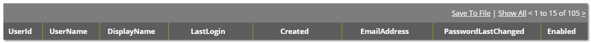

[title]: # (Reports)
[tags]: # (configuration)
[priority]: # (213)
# Reports Generated for Secret Server

After the Thycotic SCIM Connector has been installed and configured, two custom reports are generated in SS. These reports are used for bulk transactions and filtering.

>**Note**: To reduce the access privileges for the SCIM server, you can create the reports manually in SS and remove the "Administer Reports" rights from the application role that was created in SS.

To manually generate the reports in Secret Server, use the following information:

## Report 1

* __Report Name__: SCIM All Users
* __Report Description__: Report to bulk retrieve user information for the Thycotic SCIM Server
* __Report Category__: User
* __Chart Type__: None
* __Page Size__: All
* __Report SQL__:  

```sql
SELECT [UserId] ,[UserName] ,[DisplayName] ,[LastLogin] ,[Created]  ,[EmailAddress] ,[PasswordLastChanged] ,[Enabled]  

FROM [dbo].[tbUser] WITH (NOLOCK)  

WHERE [Enabled]=1  

AND [IsLockedOut]='False' AND [IsApplicationAccount] = 'False' AND    isnull([EmailAddress],'')!=''
```

When previewed, the report header must be as shown below:  



## Report 2

* __Report Name__: SCIM All User Groups
* __Report Description__: Report to bulk retrieve group membership information
    for the Thycotic SCIM Server
* __Report Category__: Groups
* __Chart Type__: None
* __Page Size__: All
* __Report SQL__:  

```sql
SELECT U.UserId, G.GroupName, G.GroupID, U.UserName  

FROM [dbo].[tbUser] U WITH (NOLOCK)  

Inner join tbUserGroup UG WITH (NOLOCK)  

ON  

U.UserId= UG.UserID AND U.[Enabled]=1 AND U.[IsLockedOut]='False' AND
U.[IsApplicationAccount] = 'False' AND isnull([EmailAddress],'')!=''  

Inner Join  

tbGroup G  

ON  

G.GroupID=UG.GroupID AND G.Active=1

```

When previewed, the report header must be as shown below:


