[title]: # (SCIM Server Settings)
[tags]: # (server settings)
[priority]: # (202)
# SCIM Server Settings

**SCIM Connector Configuration Settings are stored in Secret Server. SCIM
Connector stores secret information in the connected Secret Server. The
Application account creates a root level folder named SCIM {hostname where SCIM
Connector is installed}.**

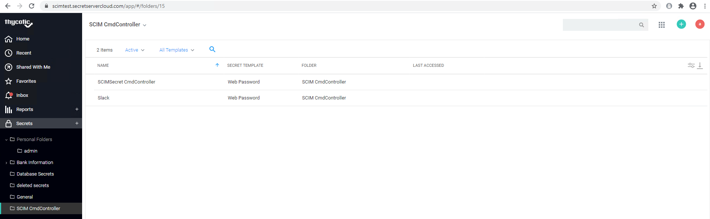

**Access to SCIM Connector is based on access to the SCIM Connector Secret
stored in Secret Server. Inside that folder a secret is created called
SCIMSecret {hostname where SCIM Connector is installed} This secret is important
for access to the SCIM Connector User Interface. To allow access to the SCIM
Connector User Interface, share this secret with the user who should have
access. Once they have access to the secret, they will be able to log into the
SCIM Connector.**

   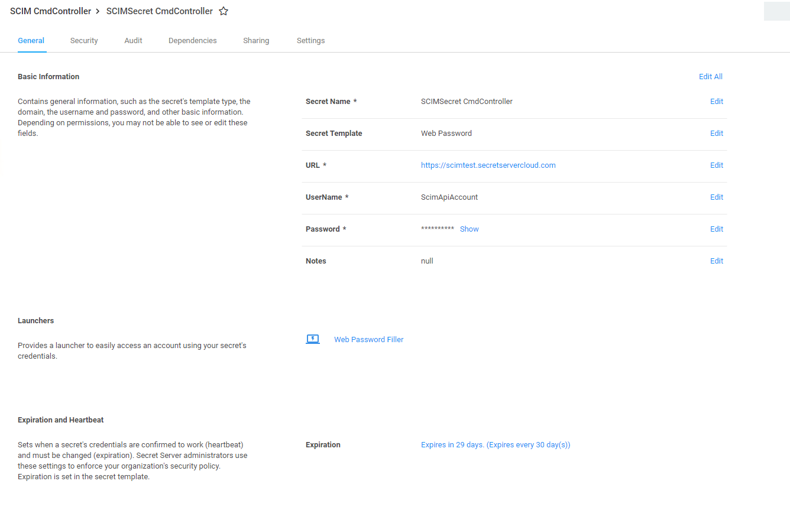

   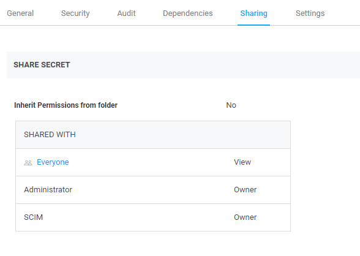

**SCIM Connector SCIM Endpoint Information is also stored in the SCIM {hostname
where SCIM Connector is installed} folder. All information that is displayed in
the SCIM Connector can be seen by selecting any of the associated secrets. This
includes user name, password, URL, Endpoint Name and token information.**

   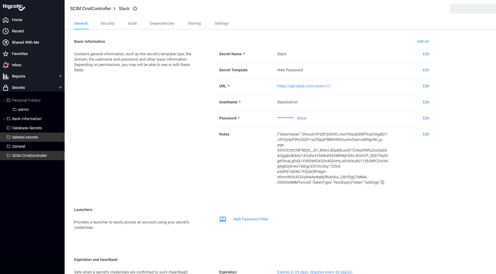

**If your Secret Server password has expired and you attempt to log into the
SCIM Connector an error message will be displayed.**

   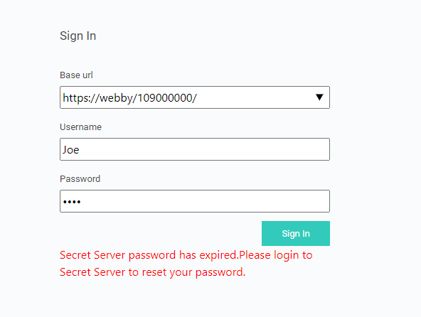

**To correct this error and log into SCIM Connector you must log into Secret
Server and reset your password.**

**Any Secret Server User can request access to SCIM Connector through Secret
Server Workflow.**

   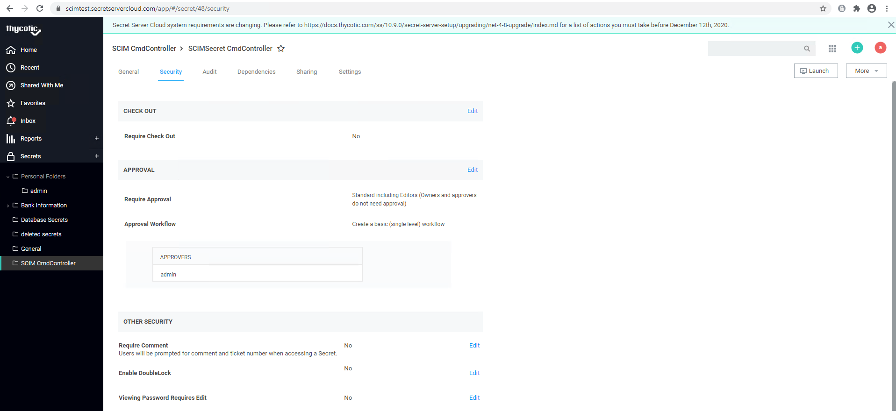

**To request access to the SCIM Connector either share the SCIM Connector Secret
with the Secret Server user who needs access, or they can simply log into the
SCIM Connector user interface. Using the log into the SCIM Connector user
interface leverages the built-in approval workflow and ensures proper auditing.
Access is initially limited to the Administrator setting up the SCIM Connector
and allowing access should be done with extreme caution due to the sensitive
nature of information that the SCIM Connector has access to both from Secret
Server as well as from the SCIM Endpoints. Some reasons for access include:
Adding a SCIM Endpoint and troubleshooting failed communication between a SCIM
Endpoint and the SCIM Connector.**

**Gaining Access to SCIM Connector leveraging Secret Server Built in Workflow
for proper auditing.**

**The person who needs access should log into the SCIM Connector using their
Secret Server Username and password.**

   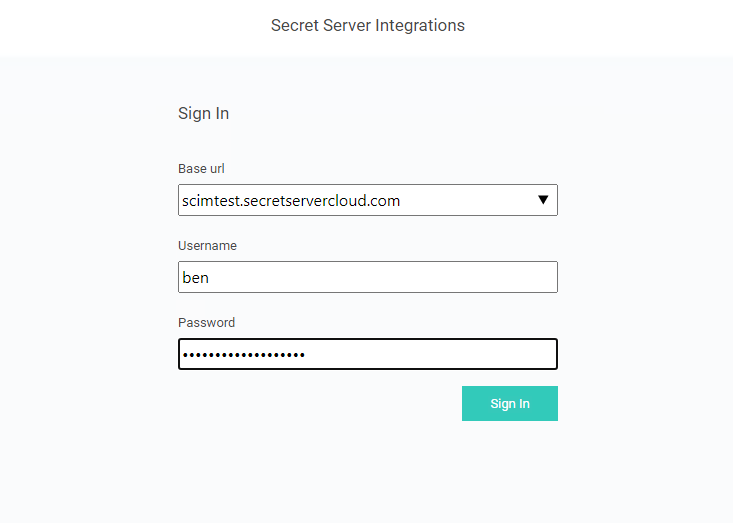

**Requesting Access to SCIM Connector -\> Pending workflow approval**

**A notice will appear indicating permission is required to access the SCIM
Connector.**

   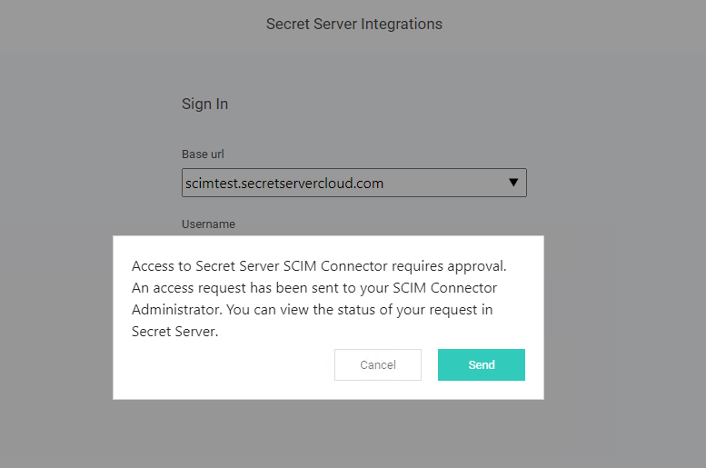

**Requesting Access to SCIM Connector -\> Workflow approval in Secret Server**

**In Secret Server the Administrator will see the request from the Secret Server
Home page. The Administrator will either allow or deny the request.**

   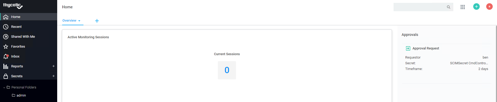

**Requesting Access to SCIM Connector -\> Approval Justification**

**When the Secret Server Administrator approves the request, a justification
dialog appears. Add the justification to the approval and select “Confirm
Approval”**

   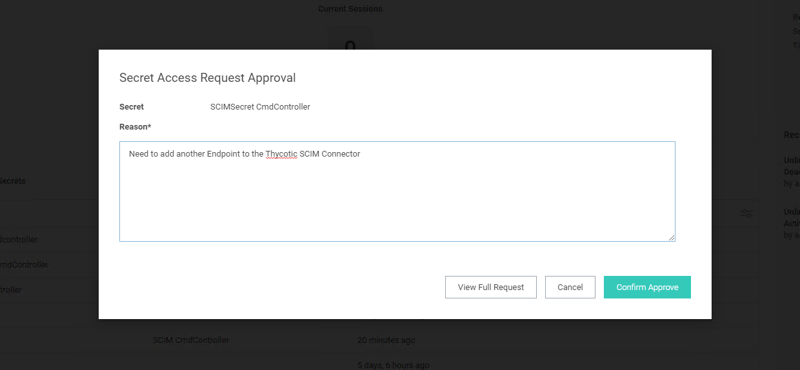

**Requesting Access to SCIM Connector -\> User can now log into SCIM Connector**

**Once approved, the requestor will then have 2 days (by default) to access the
SCIM Connector using their Secret Server Credentials. User care when allowing
access. At this point the user can add, delete, modify any settings including
server and endpoint settings.**

   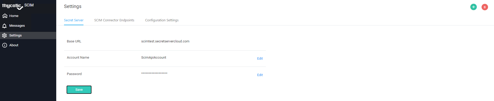

