[title]: # (SCIM Connector User Interface)
[tags]: # (connecting,configuration)
[priority]: # (201)
# SCIM Connector User Interface

### Home page

The home page provides information regarding the SCIM Standard and SCIM Version that is supported by the SCIM Connector including SCIM extensions

   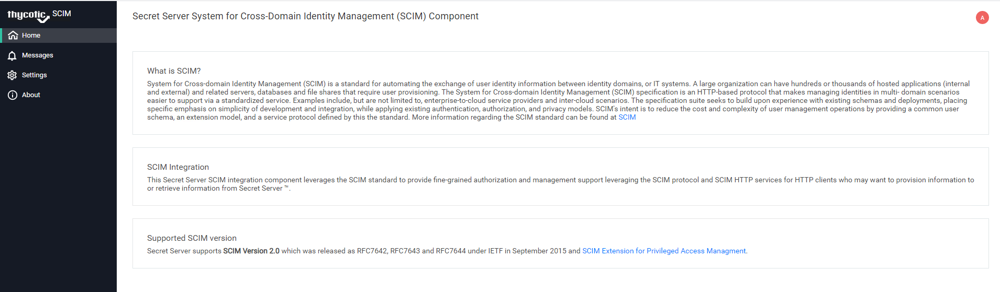

### Messages

The Messages page displays information regarding real time events that are occurring. This same information is written to the SCIM Connector log(s) that can be found in the SCIMConnector\Log directory on the IIS Server where the SCIM Connector is installed, for example `C:\inetpub\wwwroot\SCIMConnector\Log`.

Use this page to view the success or failure of requests made to the SCIM Connector. The Logs contains more detailed information including message response or detailed reasons for failures.

   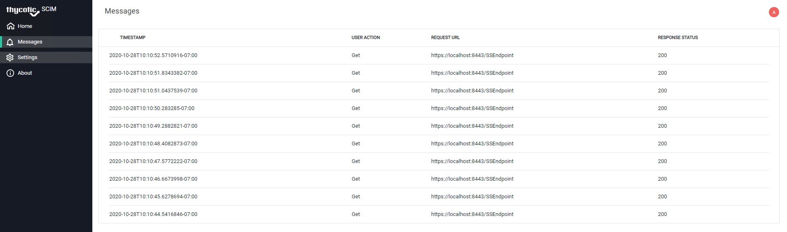

### Settings

The Settings tab contains three views: Secret Server, SCIM Connector
Endpoints, and Configuration Settings.

The Secret Server View is where the application account for the SCIM Connector is configured. Add the Application Account name and password. Clicking save will validate the application account credentials. Once the credentials have been
validated, except for logging into SCIM Connector, all communication with Secret Server will use the Application Account credentials.

   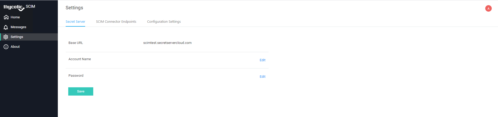

Settings | Secret Server Application Account information

   

Settings | Secret Server Application Account information validation

After clicking the save button, a __Connection Successful…__ message will appear next to the save button once the credentials have been validated.

   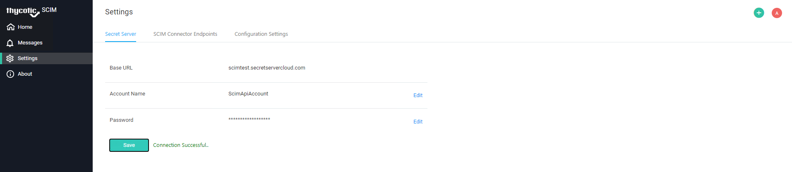

### SCIM Connector Endpoint Information

The SCIM Connector Endpoints view is used to configure information regarding what endpoints will communicate through the SCIM Connector.

   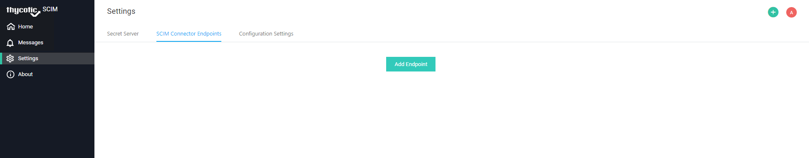

Select __Add Endpoint__ to add a new endpoint to the SCIM Connector.

   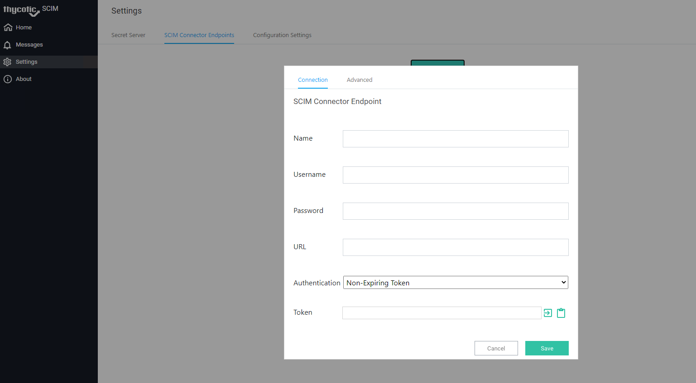

SCIM Connector Endpoint Information is required in order to provide the connecting endpoint a validation token and to keep audit what endpoint is requesting or submitting information through the SCIM Connector. Complete the Endpoint form by supplying an endpoint name, a username and password used to access the endpoint, the login or authorization URL for the endpoint. The endpoint will require a token to communicate with the SCIM Connector. Use the Generate Token button to generate a new token. Additionally, you can use the Copy button to copy the token in order to paste it into the connecting applications connection information. Often this is labeled __Authorization Token__.

   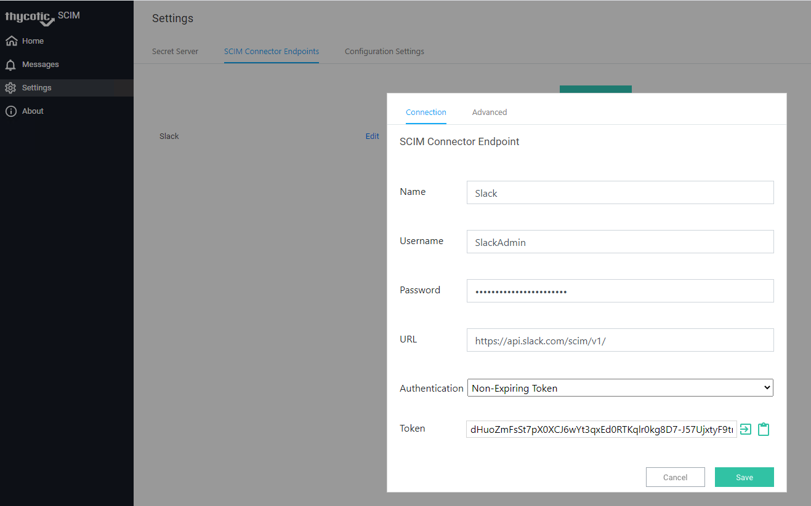

Form validation messages will be displayed if any field is missed when you select save.

   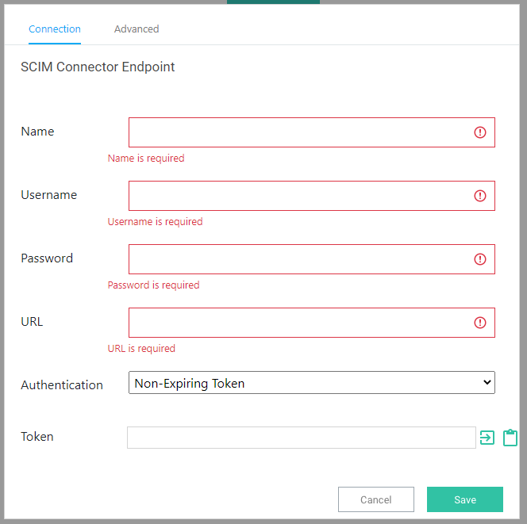

The endpoint Name must be unique across all endpoints. A warning message will appear if there is already a stored instance of the endpoint name and the information will not be saved.

   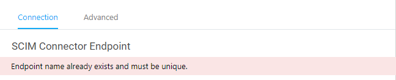

To correct the above error, give the endpoint a unique name.

Basic URL validation is performed on the URL field. If the URL is invalid a warning message will appear and the information will not be saved.

   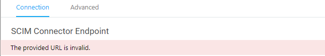

To correct the above error, provide a valid URL.

By default, SCIM Connector communicates to endpoints over a secure connection. If an http address is provided a warning may appear.

   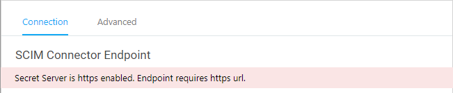

To correct the above error, either supply an https URL or select the __Allow HTTP Endpoint__ options (See SCIM Connector Configuration Settings for additional
details)

Upon clicking Save if the __Non-Expiring Token__ option is selected and no token was generated, a token will be generated. The form will remain visible so that you can copy the newly generated token to provide it to the connecting application. Clicking save a second time will close the form.

Endpoint information is stored in Secret Server.

__SCIM Connector Endpoint form:__

   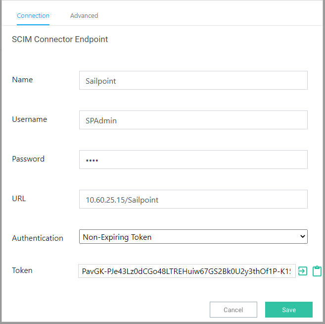

__Associated Secret Server Secret:__

   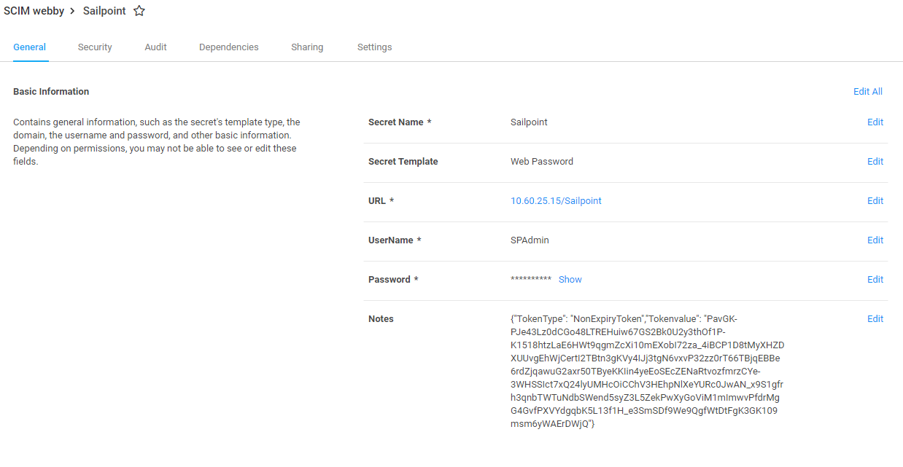

The __Advanced__ tab on the SCIM Connector Endpoint form allows specific
mappings for permission to a container or privileged data. This mapping assists
with the translation between applications. For instance, an endpoint may use __admin__ to define elevated permissions to a container or privileged data. Elevated permissions in Secret Server uses __Owner__ to define the required permission. To may endpoint permissions to Secret Server Permissions select the __Add Permission__ button.

   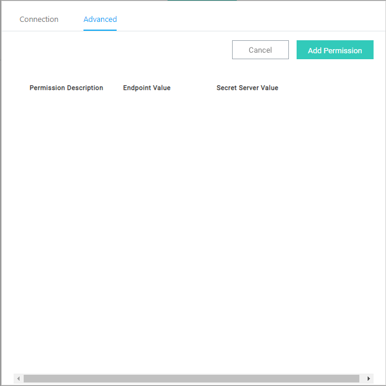

The __Add Permissions__ form will display three fields which are required. The Permission Description (Container or PrivilegedData), the value the Endpoint uses to define a permission and the associated Secret Server value.

To create a __mapping__ select the permission (Container or Privileged Data) where a mapping is desired.

   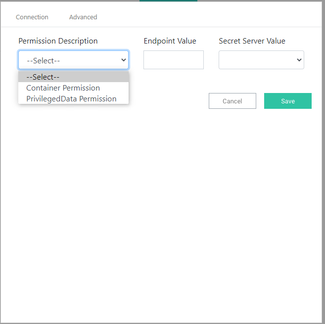

Enter the __Endpoint__ value that is to be mapped to the Secret Server value then select the desired Secret Server value.

   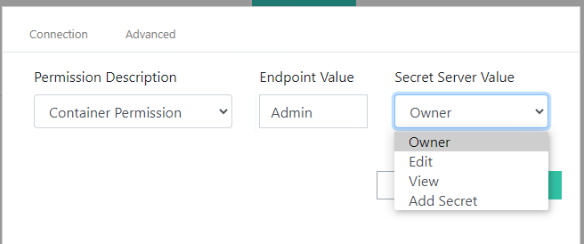

   >**Note:** that the allowable Secret Server values will change depending if Container permission or PrivilegedData permissions is selected.

   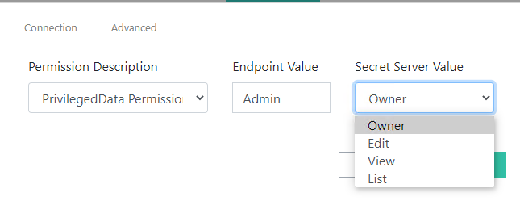

Continue to add mappings until all Endpoint values have been mapped to Secret Server values. Note that different endpoint values may be mapped to the same Secret Server Values. In the example below, both the __Admin__ and __PowerUser__ values have been mapped to Owner for PrivilegedData.

   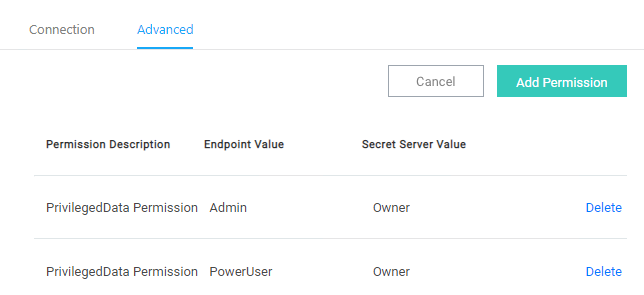

The SCIM Connector defaults to __View__ for both Container and PrivilegedData permissions. If a mapping is not found, the default value of __View__ will be used with applying permissions within Secret Server.

Once an Endpoint has been added, you can edit the endpoint information or delete endpoint entirely from the SCIM Connector. Note that once an endpoint has been deleted or the token regenerated the old toke will no longer be valid and the log may display unauthorized errors if the old token is used in an attempt to connect to the SCIM Connector.

   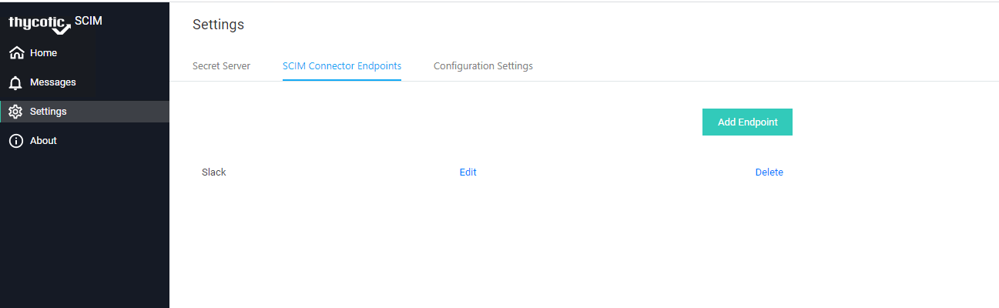

The SCIM Connector Configuration Settings view allows the SCIM Connector administrator to adjust global settings.

Bulk Max Operations. If endpoints support sending Bulk operations, use this setting to set the maximum allowable operations that will be performed in a single Bulk operation call. Setting this value too high will result in poor server performance and may result in performance. Due to this, the max number of operations supported in a single bulk operations call is 1000.

   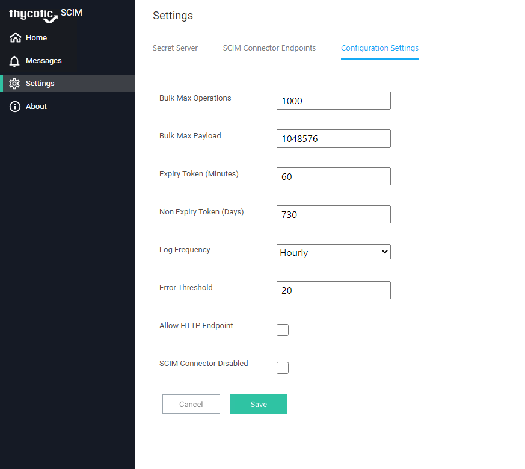

Like the number of operations supported in a single bulk operation call, SCIM Connector allows the administrator to configure the max payload size associated with a Bulk Operation call. The Max payload size is 1048576 bytes (as determined by Request.Content.Headers.ContentLength). Any message exceeding the max operations, or the max payload will be rejected and an error (Status 413
Error - The size of the bulk operation exceeds the maxOperation (1000).) will be return to the caller, logged in the log and if the messages tab is open, displayed in the messages view.

   

Expiry Token is the number of minutes a user can remain logged into the user interface before their login expires.

Non-Expiry Token is the number of days the endpoint token is valid before the SCIM Connector Endpoint must receive a new token. Note that all tokens generated before any updates will not be changed and their expiry time will be the original time that was selected when the token was generated.

Error Threshold is the number of sequential errors that the SCIM Connector will allow before it disables itself, waiting for corrective actions. This prevents unnecessary __noise__ over the network and helps ensure optimal performance of Secret Server.

Each Field that can be modified has validation. If the incorrect data type or an out of band value is entered, an error will appear next to the setting. To correct any errors, read the error description and adjust the value accordingly.

   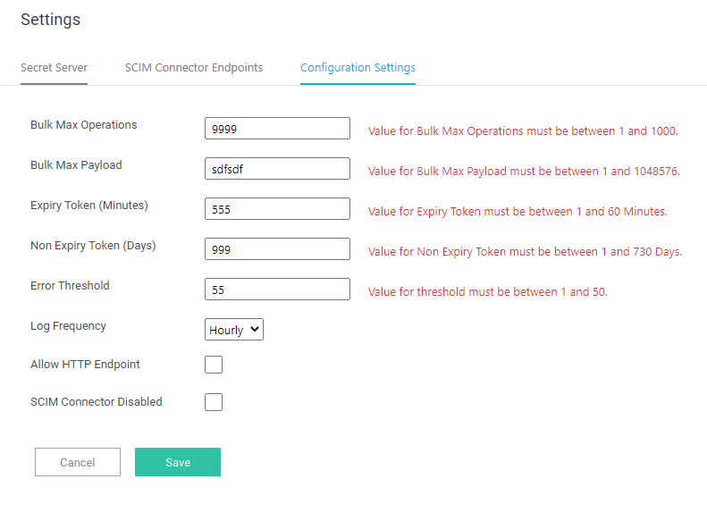

Log Frequency is used to determine when a new log file should be generated. Because in some instance logs can become very large the default is to create a new log file every hour. In low volume instances daily or weekly logs may be preferred. Select the option that best fits your environment, storage limitations, backup requirements and audit requirements.

SCIM Connector by default (and recommended) communicates over https. In some cases, endpoints fail to be able to connect over https. The Allow HTTP Endpoint enables the SCIM Connector to accept HTTP requests / calls.

   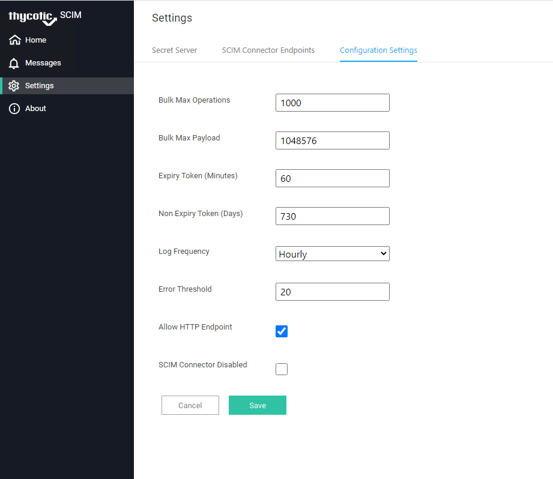

If there is a single endpoint configured to use http and the __Allow HTTP Endpoint__ option is unselected an error will appear, and the setting will not be saved.

   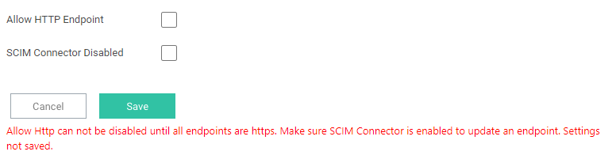

To correct this error, locate the endpoint that is configured to use http on the SCIM Connector Endpoints tab and change the URL to https.

SCIM Connector Disabled is used to pause the calling of Secret Server due to too many failed requests. If the SCIM Connector has SCI Connector Disabled selected, review the logs for errors and correct them before re-enabling the SCIM Connector.

   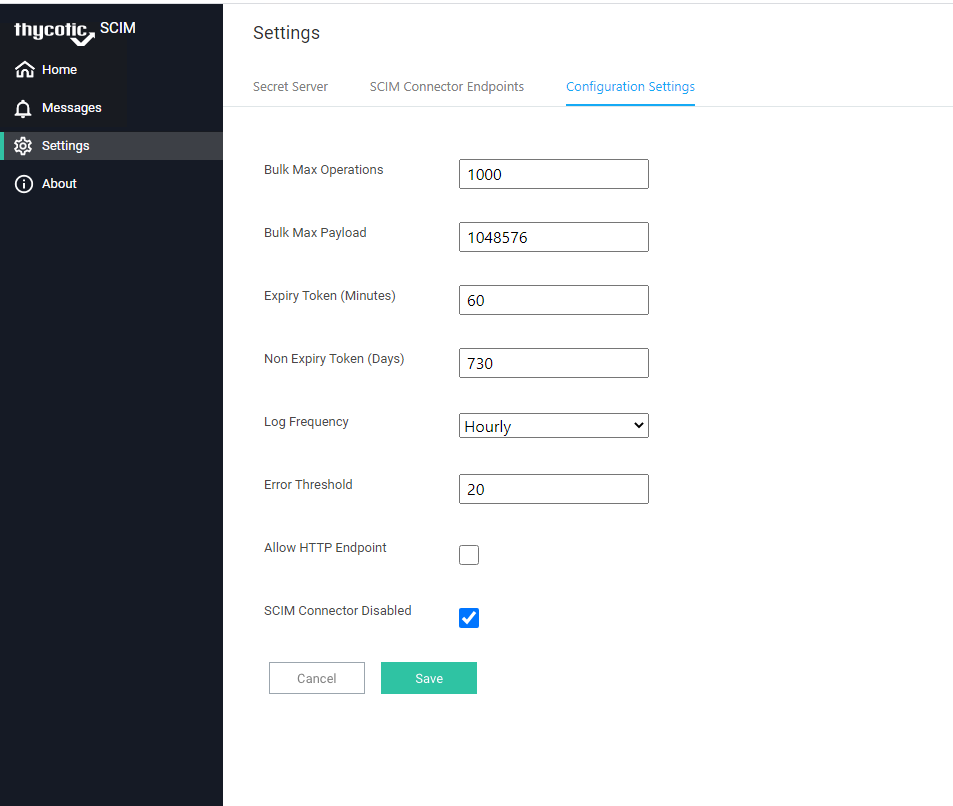

   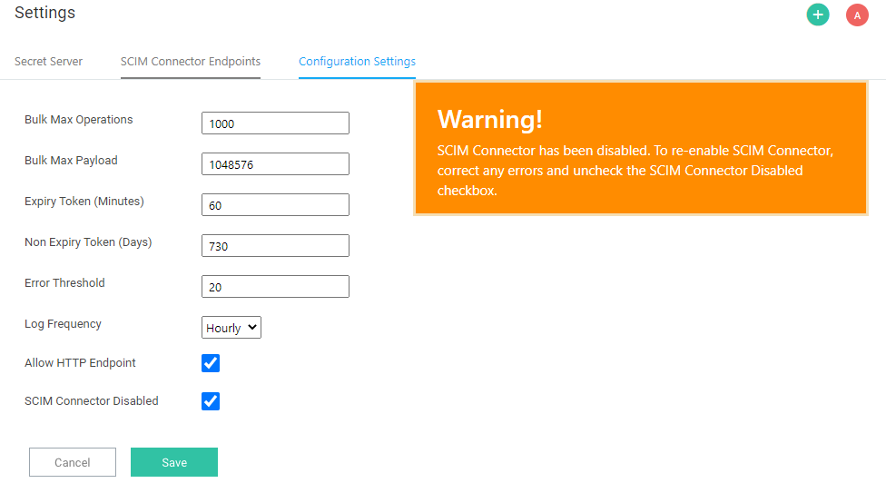

   >**Note:** If SCIM Connector is disabled, upon logging into SCIM Connector you will be immediately directed to the Configuration Settings page where the warning is displayed.

While most API calls are disabled if the SCIM Connector is disabled, there are some exceptions. The APIs that can still be called when SCIM Connector is disabled are found in the __IgnoreEndpoints.json__ file __\SCIMConnector\Responses\IgnoreEndpoints.json__.

   >**Note:** Do not modify this file unless instructed to by Thycotic Support or professional services.

These endpoints must remain active to log in and re-enable SCIM Connector. The endpoints include:

   * "Method": "get", "endpoint": "/ssendpoint"

   * "Method": "get", "endpoint": "/secretserverlist"

   * "Method": "get", "endpoint": "/webconfigsettings"

   * "Method": "post", "endpoint": "/webconfigsettings"

## SCIM Connector About

   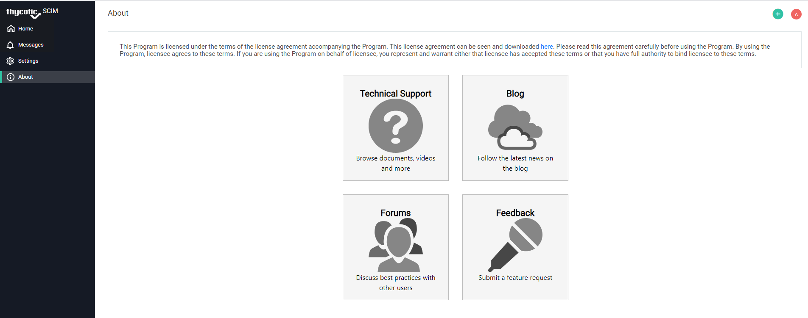
