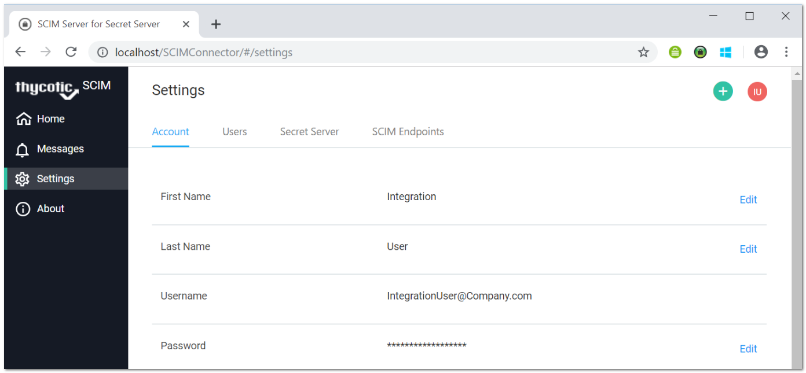
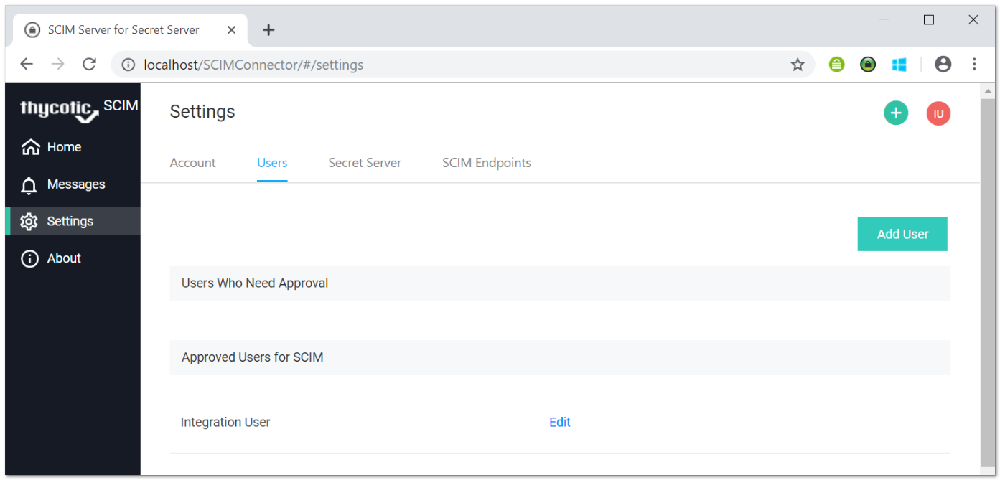
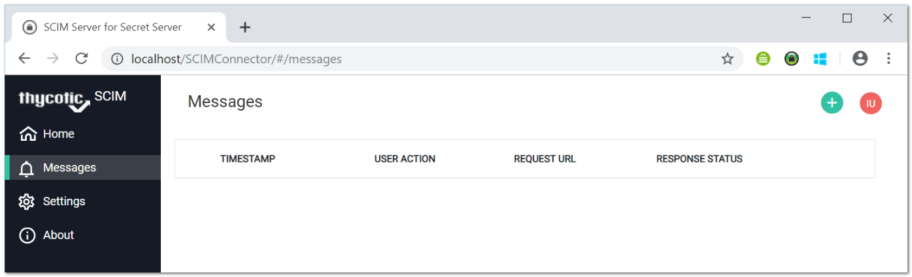

[title]: # (SCIM Settings)
[tags]: # (configuration)
[priority]: # (210)
# SCIM Connector Settings

This topic reviews the existing __Settings__ options in SCIM Connector.

To access, go to the navigation menu on the left and select __Settings__. On the __Settings__ page there are tabs at the top that can be used to view the different option sections.

## Account Tab

This section lists the details of the currently logged-in account. You can modify the existing information in each text box by selecting the __Edit__ link to the right.  



Complete the text boxes as follows:

* __First name__: The first name of the account.
* __Last name__: The last name for the account.
* __Username__: The user name that will be used to log in to the SCIM Connector application.
* __Password__: The password for the account that will be used to log in to the SCIM Connector application.

## Users Tab

This tab lists all the registered user accounts that have access to the SCIM Connector application, as well as listing the user accounts that can be approved or rejected for access. The __Users__ tab has two sections.  



* __Users Who Need Approval__: Includes a list of users that have requested access (which have registered for the SCIM Connector). Access requests can be __Approved__ or __Rejected__. On approval, the user is added to the list of approved users and they can log in.
* __Approved Users for SCIM__: Allows for the deletion of an application user or allows another application user to modify the values for another user's settings. The available text boxes for editing are:
  * __First name__: The first name of the account.
  * __Last name__: The last name for the account.
  * __Username__: The user name that will be used to log in to the SCIM Connector application.
  * __Password__: The password for the account that will be used to log in
        to the SCIM Connector application.

## Secret Server Tab

This tab is used to connect to your instance of Secret Server.

To communicate with Secret Server, the SCIM Connector application requires the connection information to your Secret Server. The base URL should point to the location where Secret Server is available by HTTPS, for instance `https://<ipaddress>/SecretServer/`.

The Account Name is the name of the application account that was created in Secret Server. The password is the password associated with the Secret Server application account.

For details on configuring this section please see the [Making a Secret Server Connection](connect-ss.md) topic.

## SCIM Endpoints Tab

This tab is used for connecting to your SCIM-integrated endpoints. For an endpoint to communicate with the SCIM Connector application, a valid endpoint must be configured.

For details on configuring this section please see the [Making a SCIM Endpoint Connection](connect-endpoint.md) topic.

## Logging

There are two places where users can access any logging or messaging within the SCIM Connector application.

### Messaging

In the SCIM Connector application, navigate to the menu on the left and click the __Messages__ menu item. This takes users to a list of any recent messages or logging that has been sent to the SCIM Connector application. The Messaging logs are archived daily on the system, but older logs can be viewed and downloaded from the audit logs (see below).  



>**Important**: Message logs deleted from the system __cannot be recovered__.

Each entry on the Messages list has these parameters:

* __Timestamp__: The time that the action call came into the SCIM Connector application.
* __User Action__: What type of action was made, such as Post, Get, or Delete.
* __Request URL__: The URL path to the application that was making the request.
* __Response Status__: The response code, which is the resulting status for the call that was made, such as Bad Request.

### Audit Logs

The Audit logs are the same as the messaging logs; however, they are viewed in a different format. Since the messaging logs are archived each day (by default), once they are archived, they are not directly available inside the SCIM Connector application, but they are still logged and are accessible on the machine that the application is installed on.

Once they are archived, the logs are stored in JSON format. The values listed in the JSON file are the same as the ones listed in the above section.

The Audit Logs can typically be accessed from the following location on the machine:

`<Drive>:\inetpub\wwwroot\SCIMConnector\Log`

> __Important__: Message logs deleted from the system __cannot be recovered__.

#### Example Log

```yaml
[
{
"RequestURI": "http://localhost:54523/SSEndpoint",
"Action": "Get",
"User": "Sailpoint_Admin",
"DateTime": "2019-03-09T04:41:26.2138238-05:00",
"ResponseStatus": 200
},
{
"RequestURI": "http://10.0.0.226:80/SSI/appuser",
"Action": "Get",
"User": " Sailpoint_Admin ",
"DateTime": "2019-03-09T04:52:10.4888392-05:00",
"ResponseStatus": 200
},
{
"RequestURI": "http://10.0.0.226:80/SSI/Users",
"Action": "Get",
"User": " Sailpoint_Admin ",
"DateTime": "2019-03-09T04:52:10.8459354-05:00",
"ResponseStatus": 200
},
]
```
