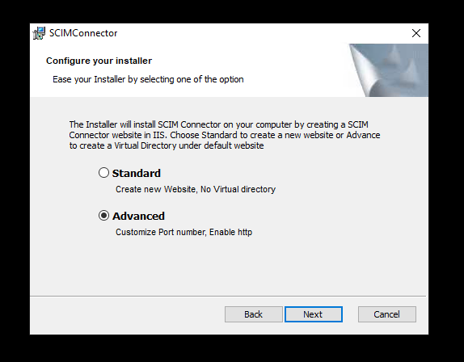
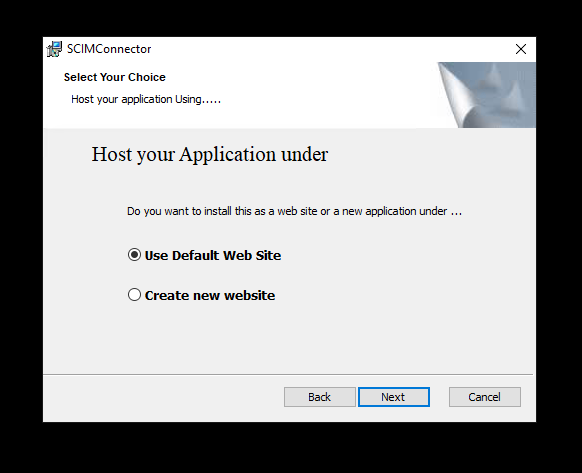
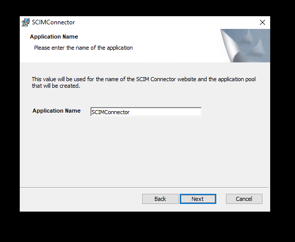
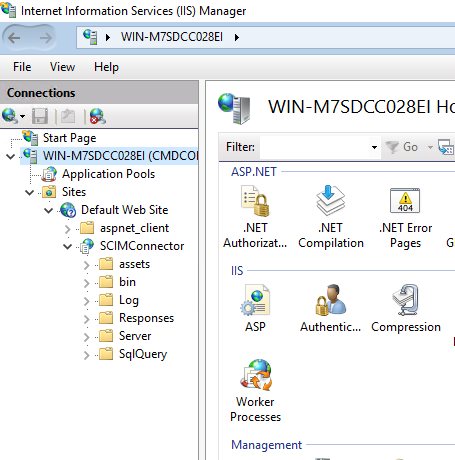
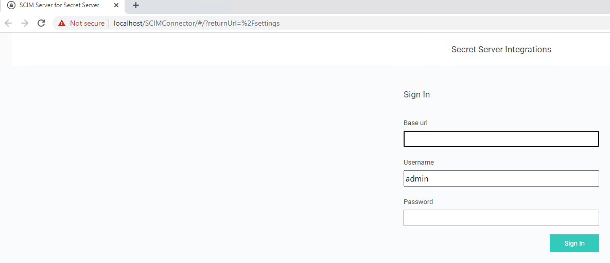
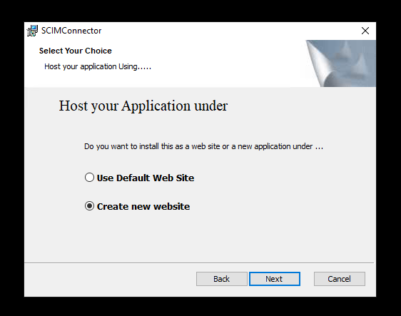
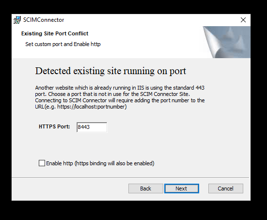
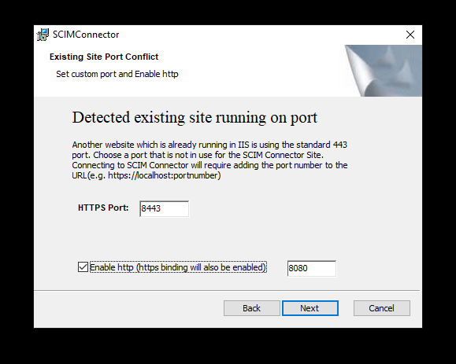
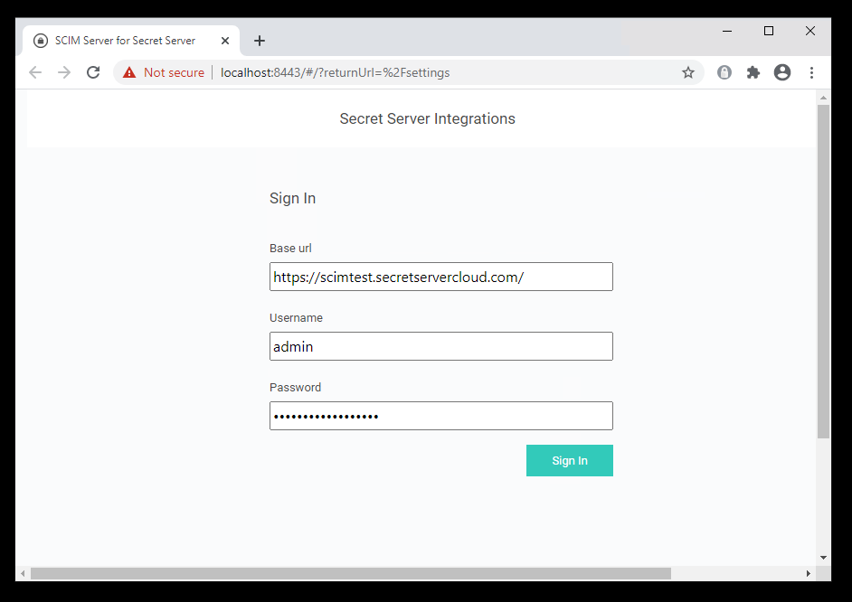

[title]: # (Advanced Installation)
[tags]: # (advanced, installation)
[priority]: # (105)
# Advanced Installation

## Download the Installer

Download the installer file at:

* [SCIM software download](https://thy.center/scim/link/SCIMdownload)

The advanced Installation Process will use the Default Web Site.

The Advanced options allow the SCIM Connector to be installed as either a virtual directory under the default web site or the creation of a new website while defining the binding ports. Much of the installation experience is the same as the standard installation process.

1. To install the SCIM Connector as a virtual directory under the Default Web Site select the Advanced option and then click __Next__.

   
1. Select __Use Default Web Stie__ and click __Next__.

   
1. Fill in the name for the application. This will be used for the virtual folder name as well as the Application Pool name. Select __Next__.

   
1. Review the license agreement. Once satisfied, check the __I accept the terms and the License Agreement__ checkbox and click __Next__.

   
1. Provide the path where the application files will be installed. A
subdirectory (SCIMConnector) will be created in the specified path. Example `C:\inetpub\wwwroot\SCIMConnector` then click __Next__.

1. For Virtual Directory installations, it is recommended that you change the path otherwise IIS Manager will show both the folder and the virtual directory.

   
1. At this point the SCIM Connector installation is ready to create the website.

   

1. After the installation has completed the default browse is launched and SCIM Connector is now ready to be configured. See Configuration section for additional details.

   >**Note:** Instead of creating a new web site the installation has created a virtual directory under the default website. The bindings or ports associated with the virtual directory are the same as the __Default Web Site__.

   

   >**Note:** the URL to access the SCIM Connector is different. To access the SCIM Connector when it is a Virtual Directory, use the host name or IP address and append /SCIMConnector.

   

1. The advanced Installation Process will create a new website.

1. The __Create new website with port options__ installation process is the same as the standard process with the addition of having the ability to predefine the ports that will be used.

1. Select __Create new website__ and click __Next__.

   

   >**Note:** It is likely that there is already a default web site in IIS. If there is a port conflict the following dialog will appear allow the selection of a custom https port. Enter the https port that is desired in the provided field.

   

1. By default, HTTPS communication is recommended however in cases where SCIM endpoints may not work with HTTPS, enable http by selecting the __Enable Http__ checkbox. Supply the custom available port for http and click __Next__.

   

1. The remainder of this Advanced option is identical to the Standard
installation process.

   

   

   

   

   Once the installation has completed, the log in page for SCIM Connector should be viewable in the default browser. If the browser does not launch you can access the SCIM Connector by browsing to the Website or Virtual application that was created. The login page requires the URL to Secret Server and a local Secret Server Administrator account.

1. Enter the __URL to Secret Server__ and the Secret Server __local Administrator Username__ and __Password__.

1. Click __Sign in__.

   

   >**Note:** You may not see the in the Base URL with future logins. This is expected. The SCIM Connector will always attempt to Secret Server over https. In cases where Secret Server does not support https (not recommended), SCIM Connector will communicate over http, however the __Allow Http__ option must be selected.

Even if the __Allow Http__ option is selected, if Secret Server allows an https connection, SCIM Connector will communicate with Secret Server over https.
