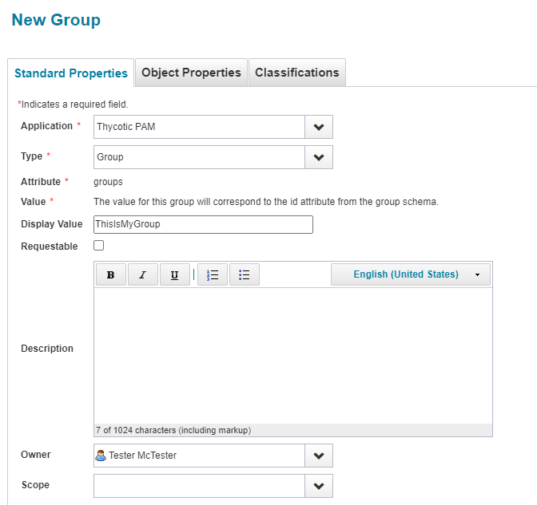
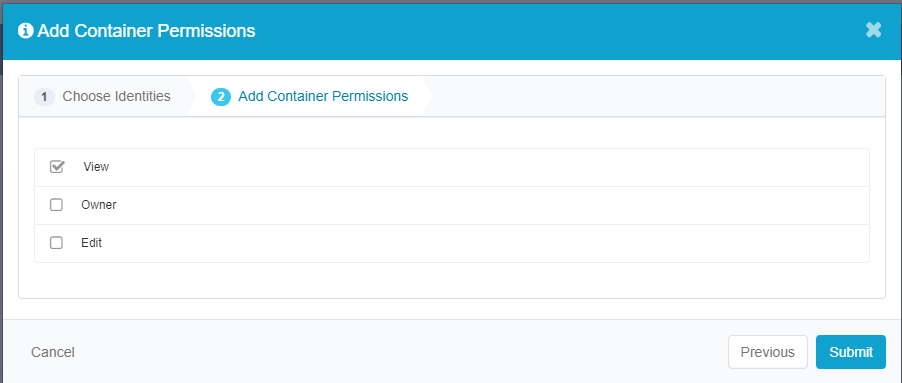
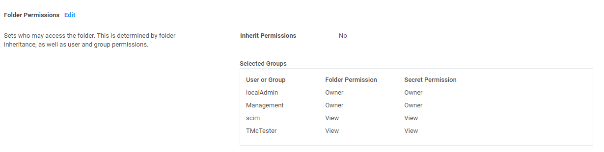

[title]: # (Best Practices and Implementation Considerations)
[tags]: # (best practices)
[priority]: # (106)
# SCIM Connector Best Practices for Integration With Secret Server

### Introduction

This document is intended to provide best practices in relation to configuring
SCIM for use with Secret Server. While we try to generalize much of the
suggestions within this document so that it can apply to others vendors that are
leveraging SCIM, we have chosen to work directly with Sailpoint as a partner for
the development of this document. This means that some of the documentation does
include screenshots specific to Sailpoint’s IdentityIQ interface and
configuration. We also reiterate Sailpoint specific limitations and concepts and
walk through a few typical use cases that may be specific to Sailpoint.

### Broad SCIM Implementation Considerations

-   Secret Server does not delete users in order to maintain audit trails. As a
    result, when you delete a user with a SCIM call, it disables the user. The
    disabled user cannot be granted access to a container, privileged data, or
    group unless they are enabled again.

-   Secret Server throws an error if instructed to delete an already deleted
    user. Disabling (deleting) already disabled users (by ID) will result in the
    SCIM Connector reporting a 404 error in the logs.

-   The process for provisioning local user accounts versus adding AD accounts
    to Secret Server via SCIM may look vastly different based on each vendor. If
    you do plan to leverage local accounts in Secret Server, it is recommended
    in your SCIM provider to auto-create passwords that align with the local
    user password policy configured within Secret Server. Otherwise you may get
    an error when generating a new account through SCIM that does not conform to
    the Secret Server Local User password requirements. This can be found in
    Admin \> Configuration \> Local User Passwords. Below is a screenshot of the
    local user password requirement that will clear our security hardening
    report.

   

-   Some SCIM providers when creating an Application define an “Owner” of that
    application. This owner may be leveraged for approvals of some requests
    within the SCIM Server. It is important to think about who you want the
    Application owners to be. This often may be aligned with Secret Server SMEs
    but may also be aligned with “approvers” that you use within Secret Server
    for Request Access For Approval workflows.

-   Careful consideration should be made when determining who should have access
    to the “SCIM Connector Secret” that is stored within Secret Server long
    term. Those who are Administering the SCIM Connector should have access to
    this Secret, but likely no other users except for possibly a Secret Server
    SME/Admin. This is because this Secret Contains legitimate account
    information for an API user within Secret Server. It is recommended to
    combine this Secret with a Request For Access workflow process for any
    additional users that may request access to this Secret outside of your
    initial defined list of users. This flow is documented in our recently
    published SCIM 2.5 documentation.

   

-   It is recommended to track where all within your environment your SCIM API
    user account is being leveraged so that you can ensure that account does not
    have access to secrets or folders that you do not want it to have access to.
    Since the account has privileged access within Secret Server, this is
    important. You may even want to align specific event subscriptions within
    Secret Server to track the activity of SCIM. There are several reports that
    are generated when using SCIM to help track this type of activity as well
    that can be sent to specific people on a schedule. Below is a list of the
    built in reports that are generated and can be used:

    -   SCIM All Users

    -   SCIM All Groups

    -   SCIM All User Groups

    -   SCIM All Folders

    -   SCIM All Folder Permissions

    -   SCIM All Secrets

    -   SCIM All Secrets Permissions

-   It is important to be mindful of this setting under **Admin \> Configuration
    \> Folders.**

   

If this is set to Yes, which is a best practice within Secret Server, you will
need to be careful when breaking inheritance to assign permissions to a user to
a subfolders from your SCIM provider. If for example they are assigned “View”
access to a subfolder but not the parent folder, then they may not be able to
navigate to the folder that they have been provisioned access to. If this
setting is unchecked, they will be able to view the folder structure and access
the specific subfolder they’ve been regardless of parent folder level access.

### Sailpoint Specific Concepts and Limitations

<https://docs.thycotic.com/scim/2.0.0/vendors/sailpoint/sp-constraints.md>

-   In SailPoint IdentityIQ, there are “containers” and “privileged data.” The
    containers map to Secret Server folders, and privileged data maps to
    secrets.

-   SailPoint allows adding permissions to containers, but they cannot be
    directly added to privileged data. That is, they cannot be added directly to
    a Secret Server Secret. So when a user gets access to a container, the user
    is really getting access to a Secret Server folder.

-   While there is no direct way to give users access to a specific secret, they
    can still be given access indirectly by adding a user into a group that
    already has access to both the folder/container and the secret/privileged
    data.

-   When a users are given access to a container/folder, either with direct
    access or by adding them to a group, they only have “view” access to the
    container. More granular assignment of permission levels can only be defined
    in SS.

-   If the “view” permission setting seen in the Configuring a “SailPoint
    IdentityIQ Endpoint” section is not configured correctly, an incorrectly
    formatted POST call to the SCIM Connector application will result, which
    returns a HTTP 400 error message.

-   Any sensitive information that is associated with a secret/privileged data,
    such as a password, is not shared over the SCIM Connector and must be viewed
    in SS.

-   Personal folders in Secret Server can be viewed in SailPoint, but users
    cannot be given direct access to the folders. However, users can be given
    access by adding them to an existing group. The owner of the personal folder
    cannot have their access removed from the folder.

-   Using custom attributes or extensions with SailPoint IdentityIQ and the SCIM
    Connector is not currently supported.

*The following sections assumes that you have Sailpoint connected to Secret
Server SCIM and that the connectivity has been validated as working. Below we
cover the most common “Create” type use cases*

### SCIM - Creating New Users

For creating new “Local” users in Secret Server from Sailpoint, ensure that you
have a Provisioning policy with a form for creating new accounts. Below is a
screenshot of this area in Sailpoint.

   

The form itself has a few fields that are relevant to be completed for new users
provisioned through Sailpoint

   

The password field aligns with a password policy rule. This rule should align
with your Secret Server’s local password policy so that you can ensure when
users are provisioned through Sailpoint, that they are compliant with the rules
enforced for new local users in Secret Server, and provision correctly.

   

   

Create a new identity in Sailpoint. This can be done under the **Manage
Identity** section and by clicking **Create Identity.**

   

Approve the creation of the account. Under **Manage Access** \> **Manage
Accounts** section, locate the user you created then click **Manage**

   

Click the **Request Account** button

   

Select **Thycotic PAM.**

   

When you get to the **Submit** page it will indicate that more information is
needed and you need to complete a form.

Complete the form.

   

Click OK at the bottom. The account change submission should happen and can be
tracked under **My Work \> Access Requests.**

   

You can check Secret Server to verify that the account has been created under
**Admin \> Users.**

   

If you run your Perform Identity Request Maintenance task, you should see the My
Work Access Request show up as complete

   

When assigning a user to an AD group, simply provision the user to the AD group
within Sailpoint. The easiest way we have found to do this is under the **Manage
Access \> Manage User Access** tab. Filter based on the Active Directory
Application you have already added to Sailpoint.

   

   

   

Ensure that on the Secret Server side, that this group is set up for
Synchronization for the Domain you have added. On the next Secret Server AD
synchronization, this user will be added to Secret Server and will be
provisioned access to any folders where that AD group is aligned for access.

### SCIM – Assigning Users to Local Secret Server groups 

Go to the **Manage Access \> Manage User Access** tab and apply a filter to
filter based on the Thycotic PAM application. This should reveal any local
groups in Secret Server

   

   

You can verify this user was added to the group in Secret Server

   

### SCIM – Creating New Groups

One way to create local groups within Secret Server through Sailpoint is under
the **Applications \> Entitlement Catalog** section. You can click on **Add New
Entitlement**

   

Then click on the Thycotic PAM Application. For Type, choose Group, and for
Display Value enter the display value of your group.

   

   

After you click save, you will have to approve the workflow. Then the group will
be created in Secret Server.

   

As previous examples have shown, you can create a provisioning policy form
similarly to the Create Identity form we did earlier.

### SCIM – Assigning Users To Folders

When assigning users to folders, please ensure that the SCIM API account has the
correct access to the folder in which you want to add the user to. As mentioned
in the best practices, assign the minimum permissions needed for anticipated
access that is required to be provisioned through SCIM.

In this example I removed the Tester account from the management group in Secret
Server. I then assigned the user to the Data Management folder in Secret Server
through Sailpoint.

(Before)

   

   

In Sailpoint, go to **Manage Access \> Privileged Account Management.** Locate
the Folder in question and click manage

   

Click the **Add Identities** button

   

   

Align the View permission

   

After the task has ran, verify that the account has been added to the folder

   

