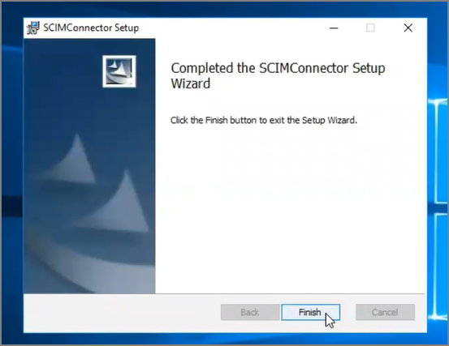
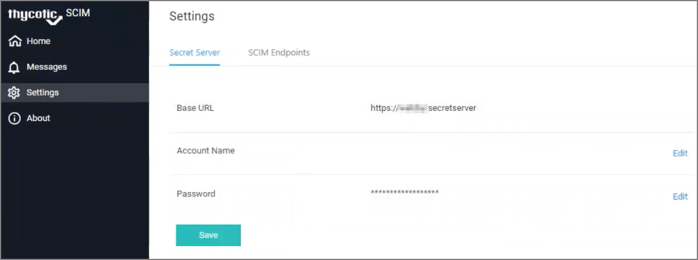

[title]: # (Default Install)
[tags]: # (introduction)
[priority]: # (102)
# Default Installation

## Download the Installer

Download the installer file at:
* https://updates.thycotic.net/scim/v2/scimconnector_2.0.zip

* https://updates.thycotic.net/scim/v2/scimconnector.msi

## Installation Steps

1. Using Local Administrator credentials, run the installation file. 

   

1. Accept the default installation location or select/specify a custom installation location.

   
   
1. Click the __Licenses terms and conditions__ link to review the license terms.
1. Select the __I agree to the License terms and conditions__ check box. The INSTALL button becomes enabled.

   
1. Click __INSTALL__. The installation begins, and the following actions occur:

   1. The Install files are installed on the system.
   1. The application pool is configured.
   1. The IIS web application is configured.
   1. A self-signed certificate is added to the certificate store (for encryption purposes).
   1. IIS is restarted.
   1. The completed installation screen displays:

      The following buttons are provided:

      * __Readme__ – Opens the Getting Started guide.
      * __Run__ – Closes the installer and immediately runs the SCIM Connector application.
      * __Finish__ – Closes the installer without running the SCIM Connector application.

   
   >**Note**: The first user to register is automatically approved to access the Thycotic SCIM Connector. Additional users can be registered to access the SCIM Connector later, but these other accounts require approval (from within the SCIM Connector application itself) before access is granted.
   >The URL for the Sign in page is to localhost/SCIMConnector/.

   

1. Click __Sign In__. The SCIM Connector interface page loads:

   
   

When you click the __Settings__ menu item on the left, the Settings tab appears, providing the following set up options.

   

   * See [Making a Secret Server Connection](https://thycotic.force.com/support/s/article/SS-INTG-EXT-SCIM-Connector#ConnectingtoSecretServer)
   * See [Making a SCIM Endpoint Connection](https://thycotic.force.com/support/s/article/SS-INTG-EXT-SCIM-Connector#SCIMEndpoints)
