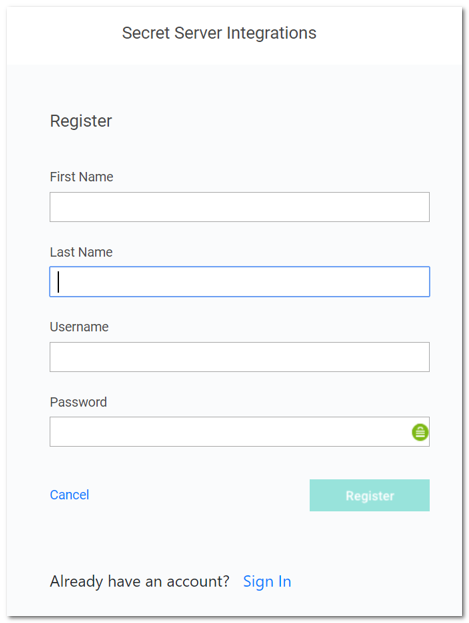

[title]: # (Manual Install)
[tags]: # (introduction)
[priority]: # (106)
# Manual Installation

To manually install the SCIM Connector:

1. Navigate to the Thycotic website and download the Installer Zip file for the SCIM Connector application.
1. Using Administrator credentials, unzip the contents of the __ZIP__ file into the IIS directory. Fore xample, unzip the contents to `C:\inetpub\wwwroot\SCIMConnector`.
1. Navigate to the __web.config__ file, located in the application root directory, and modify the following properties:

   ```
   <add key="CERT_NAME" value="CN={Your Certificate Name}" />
   <add key="LOG_PATH" value=" {Application Root File Path} \Log" />
   ```

   >**Note**: The certificate that is used in this step is for encryption or decryption with the Configuration.enc file. For this certificate to be valid it must meet the following criteria:
   >* It should be added to the machines personal certificate store so all uses on the machine have access. This is not the user's personal store. After adding it, you should be able to see it in the "Manage Computer Certificates" dialog under Personal > Certificates.
   >* It should be set for encryption/decryption (which can usually be specified when adding it to the certificate store).
   >* IIS_USRS must have read permissions to the certificate. This is usually set for certificates by default.
   >
   >If you don't want to manually create a certificate, or use an existing one, you can use the following PowerShell command to generate one. This is the same certificate that is generated with the default installer:

   ```powershell
   New-SelfSignedCertificate -Type DocumentEncryptionCert -Subject "CN=SSScim" -Provider "Microsoft Enhanced Cryptographic Provider v1.0" -KeyUsage KeyEncipherment, DigitalSignature -KeyAlgorithm RSA -KeyLength 4096 -CertStoreLocation "Cert:\LocalMachine\My" -NotAfter (Get-Date).AddMonths(36)
   ```
1. Open IIS Manager to create a new application pool.
1. Under __Sites | Default Web Site__, select and right-click the __SCIMConnector__ folder.
1. Select __Convert to Application__.

   
1. The Add Application dialog box appears:

   
1. Click the __Select__ button to change the selection to SCIM Connector.

   
1. Click to select the __Test Settings__ option to ensure IIS returns _The application pool identity is valid_.

   
1. Right-click the newly created application (__SCIMConnector__) and select __Manage Application | Browse__.
1. This open the default Secret Server Integrations Sign In page. To register an account with Secret Server, click the Register link. A registration page appears in your default browser:

   
1. Enter the registration details for the account.

   >**Note**: This registration is only for accessing the SCIM Connector application on this machine and not for connecting to SS or a SCIM Endpoint, which are described later.
1. Click __Register__. A Sign in page appears:

   

   >**Note**: The first user to register is automatically approved to access the Thycotic SCIM Connector. Additional users can be registered to access the SCIM Connector later, but these other accounts require approval (from within the SCIM Connector application itself) before access is granted.
   >The URL for the Sign in page is `localhost/SCIMConnector/`.
1. Complete the sign in information you entered earlier as part of the registration.
1. Click __Sign In__. The SCIM Connector interface page loads:

   

When you click the __Settings__ menu item on the left, the Settings tab appears, providing the following set up options:

   * See [Making a Secret Server Connection](https://thycotic.force.com/support/s/article/SS-INTG-EXT-SCIM-Connector#ConnectingtoSecretServer)
   * See [Making a SCIM Endpoint Connection](https://thycotic.force.com/support/s/article/SS-INTG-EXT-SCIM-Connector#SCIMEndpoints)
