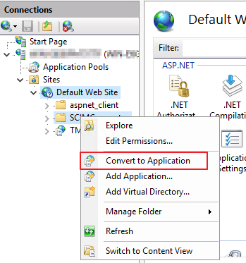
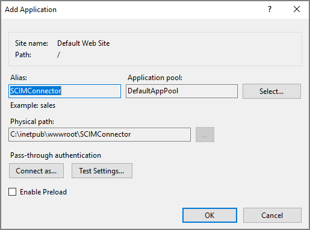
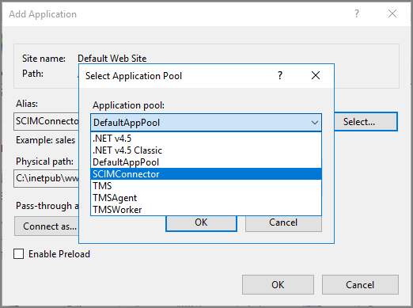
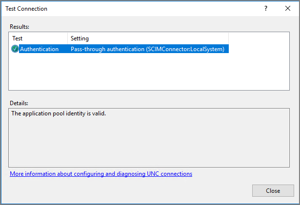
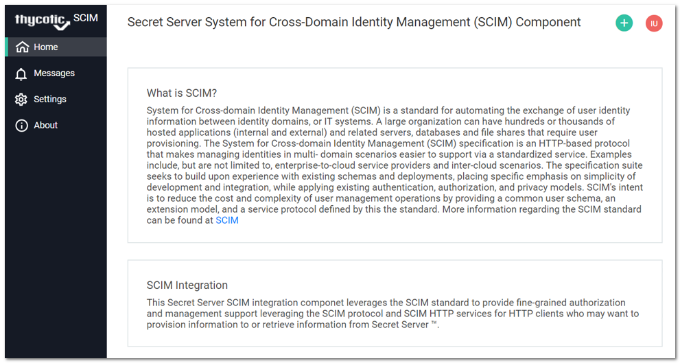
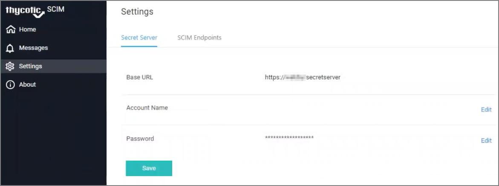

[title]: # (Manual Install)
[tags]: # (introduction)
[priority]: # (103)
# Manual Installation

## Download the Installer

Download the installer file at:
* https://updates.thycotic.net/scim/v2/scimconnector_2.0.zip

* https://updates.thycotic.net/scim/v2/scimconnector.msi

To manually install the SCIM Connector:

1. Download the Installer Zip file for the SCIM Connector application.
1. Using Administrator credentials, unzip the contents of the __ZIP__ file into the IIS directory. For example, unzip the contents to `C:\inetpub\wwwroot\SCIMConnector`.

1. Open IIS Manager to create a new application pool.
1. Under __Sites | Default Web Site__, select and right-click the __SCIMConnector__ folder.
1. Select __Convert to Application__.

   
1. The Add Application dialog box appears:

   
1. Click the __Select__ button to change the selection to SCIM Connector.

   
1. Click to select the __Test Settings__ option to ensure IIS returns _The application pool identity is valid_.

   
1. Right-click the newly created application (__SCIMConnector__) and select __Manage Application | Browse__.

1. Enter your Secret Server URL and credentials.

   >**Note**: The first user to login is automatically approved to access the Thycotic SCIM Connector. Additional users can be given access to the SCIM Connector later, but these other accounts require approval (from within Secret Server) before access is granted.
   >The URL for the Sign in page is `<Base URL>/SCIMConnector/`.
1. Complete the sign in information you entered earlier as part of the registration.
1. Click __Sign In__. The SCIM Connector interface page loads:

   

When you click the __Settings__ menu item on the left, the Settings tab appears, providing the following set up options.

   

   * See [Making a Secret Server Connection](https://thycotic.force.com/support/s/article/SS-INTG-EXT-SCIM-Connector#ConnectingtoSecretServer)
   * See [Making a SCIM Endpoint Connection](https://thycotic.force.com/support/s/article/SS-INTG-EXT-SCIM-Connector#SCIMEndpoints)
