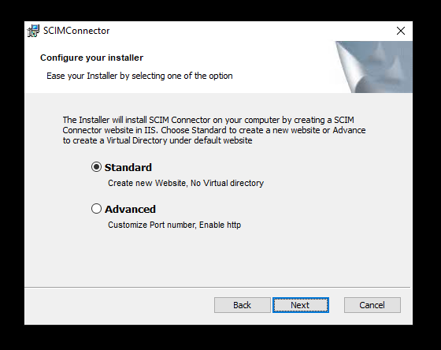
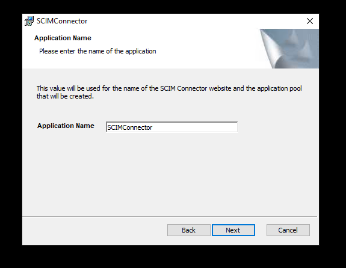
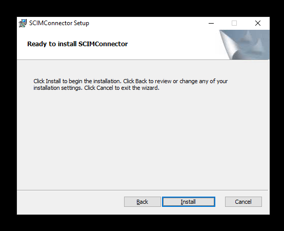

[title]: # (Standard Installation)
[tags]: # (standard, installation)
[priority]: # (104)
# Standard Installation Process

## Download the Installer

Download the installer file at:

* https://thycoticdownloadsprod.blob.core.windows.net/ssintegrations/SCIMConnector/SCIMConnector.2.5.msi

## Installing SCIM Connector

The Thycotic SCIM Connector uses a Windows Installer installation to install and configure the SCIM Connector website. There are three main paths that the installer leverages to setup the website.

## Basic Installation

Run the SCIMConnector.msi on the server where IIS is available. The installation will perform basic readiness checks and guide you through the website setup.

   

After the initial welcome dialog, select the type of installation to perform.

## Standard Installation Process

The standard installation process is used to install the SCIM Connector into a new website in IIS. Often this will require a custom port, however if port 443 and port 80 (standard https/http ports) are not bound to any site, SCIM Connector site will be bound to them by default. If Ports 443 or 80 are already bound to a website on the IIS server, a new port will be selected for the SCIM Connector site. Port selection for https will start from 8443 and increment by one (e.g. 8444) until an available port is found. For http, the port selection will start at 8080 and increment up by one. Use the Advanced option if you want to pick the ports that SCIM Connector will use.

1. Select the Standard option to create a new website in IIS and click __Next__.

   
1. Provide the Application Name (this will also be the website name) and click __Next__.

   
1. Review the license agreement. Once satisfied, check the __I accept the terms and the License Agreement__ checkbox and click __Next__.

   
1. Provide the path where the application files will be installed. A subdirectory (SCIMConnector) will be created in the specified path. For example, `C:\inetpub\wwwroot\SCIMConnector` then click __Next__.

   
1. At this point the SCIM Connector installation is ready to create the website.

   
1. After the installation has completed the default browse is launched and SCIM Connector is now ready to be configured. See Configuration section for additional details.

   
1. The install has created a subdirectory called SCIMConnector and the
application files can be seen in this folder.

   
1. A new website has been created which can be seen in the IIS Manager.

   
1. An Application Pool has been created called __SCIMConnectorAppPool__. This can also be viewed in the IIS Manager.

   
Reviewing the Basic Settings of the SCIMConnector website, the site is
associated with the application pool that was created.

   
1. HTTP and HTTPS Bindings have been created for the web site.

   >**Note:** The ports may differ from the standard http / https ports. This is due to another website in IIS has already consumed the standard ports for http and https (80/443).

   

The installation will search for a certificate with the hostname and use this for configuring https. This can be changed after the installation to any certificate that is desired and available. If no certificate is found, the installation will create a self-signed one.
