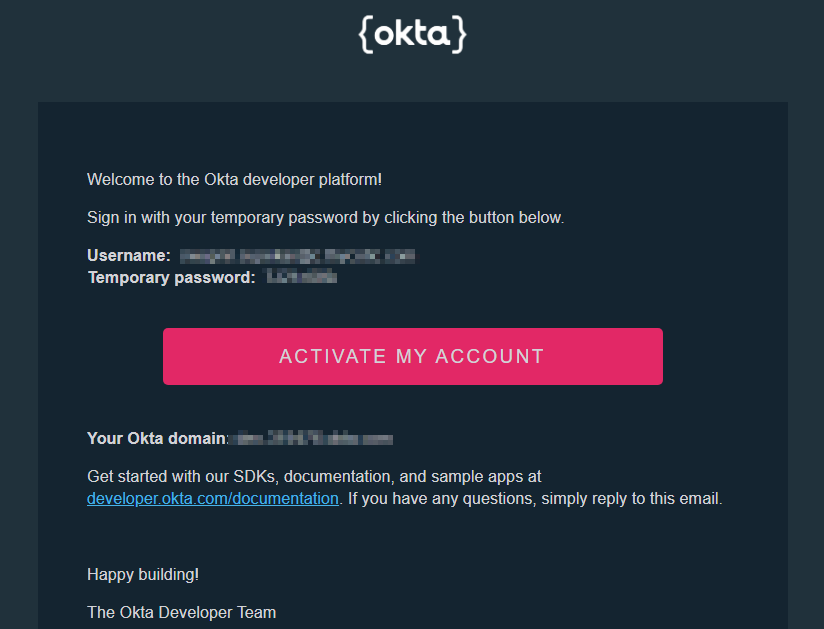
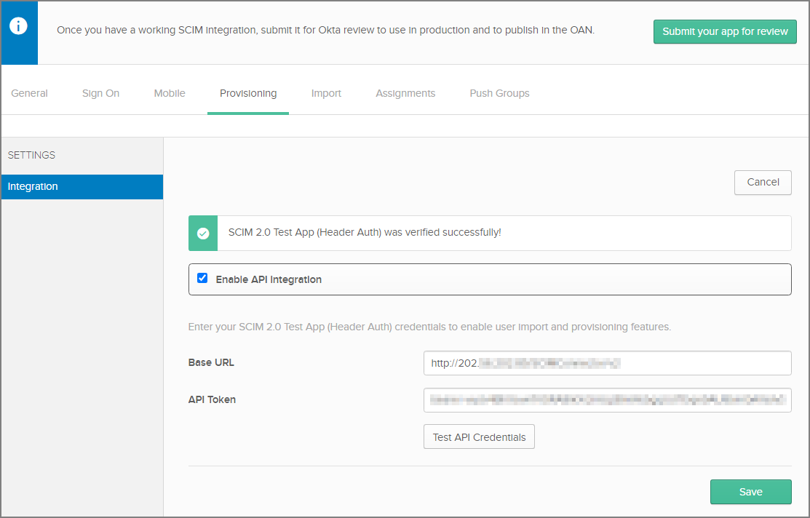
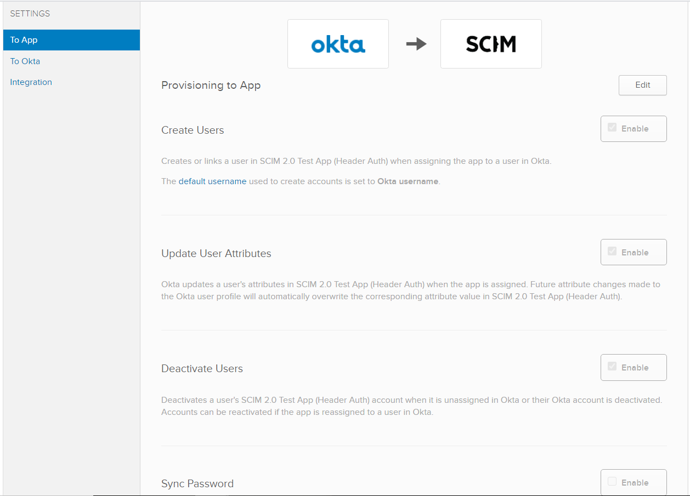

[title]: # (Okta Provisioning)
[tags]: # (okta)
[priority]: # (3)
# Okta Provisioning

## Connect your SCIM service with a Okta integration

1. Begin by signing up for an developer account using URL:
    `https://developer.okta.com/signup`

1. After the creating account we will receive the email, open the link to your developer account.

   
1. Enter the __username__ and __password__.

   
1. Navigate to the Admin Console in your Okta org by clicking __Admin__.

1. If you are in the Developer Console, click __Developer Console__ and then __Classic UI__ to switch over to the Admin Console in your Okta org.

   
1. Click __Applications__.

   
1. Click __Add Application__.

   
1. Search for __SCIM 2.0__.

   >**Note:** Three different SCIM template applications, will be displayed each of the three authentication methods that you can use to connect to your SCIM implementation (Basic Auth, Header Auth, or OAuth Bearer Token).

   
1. Select __SCIM 2.0 Test App__ (Header Auth).
1. Click __Add__ on the template to use.

   
1. On the __General Settings__ page, give your integration a descriptive name and click __Done__.

   
1. On the __Sign-On Options__ page, verify SAML 2.0 is selected.

   
1. Click the __Provisioning__ tab, and in the main panel, click __Configure API Integration__.

   
1. Select the __Enable API Integration__ check box.

   
1. Enter the base URL and Token from the Thycotic SCIM Connector HTTP Header. To authenticate using HTTP Header, provide a bearer token to access your SCIM implementation.  

   
1. Click __Test API Credentials__ to test whether the Okta integration can connect to your SCIM API.

   
1. Click __Save__ to complete the API integration.

## Configure your Okta integration

1. Login to __Okta__ using dev account.

1. Click on __application__ | __applications__.

   
1. Click on the __SCIM application__ created above.

   
1. Click On the __Provisioning__ tab of your Okta integration page, there are now three options listed in the __SETTINGS__ panel:

   * __To App__
   * __To Okta__
   * __API Integration__

1. Click __App__.

   
1. Click __Edit__ to make changes to the following sections.

   
1. Navigate to __Directory__.
1. Click on __People__.

   
1. Click on __add Person__ and enter the details. 
1. Click on __Save__.

   
1. Again go to __SCIM__ Application and click on __Assignments__.

   
1. Click on __Assign__ and select __Assign to People__.

   
1. Select the user which we want to sync to Secret Server and select __Assign__ and then click on __Done__.

   
1. Click on __Save and GoBack__.

   
1. User will be sync to Secret Server.
1. Login to __SecretServer | click on Admin | Users__.
1. Search for the user created in Okta in Secret Server

   
1. To import the user and groups from Secret Server click on the __Import tab__.

   
1. Click on __Import Now__.

   
1. After completion of process users from Secret Server will be displayed.

   
1. Click on __Directory | Groups__.

   
1. SecretServer Groups will be displayed.

   
