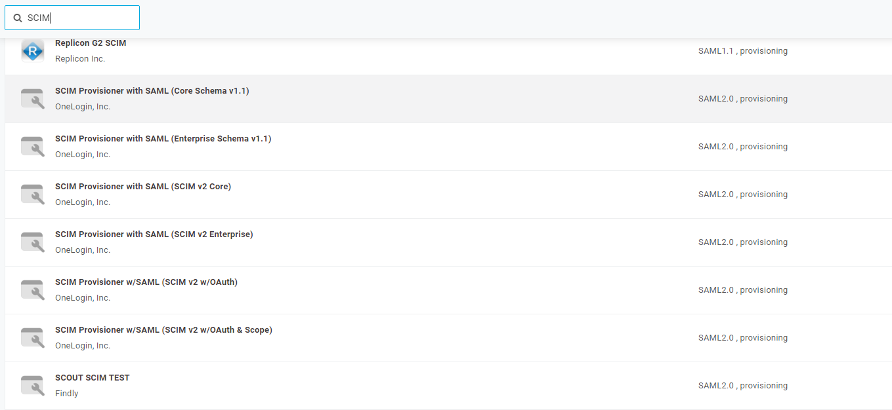

[title]: # (OneLogin)
[tags]: # (onelogin)
[priority]: # (1)
# OneLogin Provisioning

## Connect your SCIM service with a OneLogin integration

1. Begin by signing up for a developer account using URL:
`https://www.onelogin.com/developer-signup`

1. After creating the account, you will receive an email with a link to verify your developer account.

   
1. Enter the __username__ and __password__.

   
1. Click __Applications__.

   
1. Click on __Add App__.

   
1. Search for __SCIM__.

   
1. Select SCIM Provisioner with SAML(SCIM v2 core) and enter __display name__ and click __Save__.

   
1. Create a new endpoint in “Thycotic SCIM Connector” for OneLOgin. To authenticate using SCIM Bearer Token, provide a bearer token to access your SCIM implementation.

   
1. Click on __Configuration__, give your __SCIM Base URL__ and __SCIM Bearer Token__.
1. Click on __Enable API Connection__.

   

## Configure your OneLogin integration

1. Click on __Provisioning__ and select enable __Provisioning__.

   
1. Click the __Users__ tab, and click __New User__.

   
1. Enter the details of the user and click on the __Save User__ button.

   
1. Click __Application__ then click on __+__ button to Add __Thycotic Secret Server__ application.

1. Click on __Save__.

   
1. Click __Pending__.
1. Click __Approve__.

   
1. After clicking approve the user will be __Provisioned__.

   
1. Navigate to __Secret Server | Users__ and search for __robertt__. the user Robertt has been created in secret server.

   
1. Click on “__User Info__” in OneLogin and update the username to __robertty__.
1. Click on __Save User__.

   
1. Now move to Application and click on __pending__.
1. Click on the __Approve__ button.

   
1. The User will be __modified__ and __Provisioned__.

   
1. Navigate back to __Secret server__ and you should see the user __displayName__ is updated with __robertty__ .

   
1. Click on __Application__ | __Applications__ and select __Thycotic Secret Server__ application.

   
1. Click on __Users__ and select Robert tail user.

   
1. Select the group that has come from Secert Server for the user and click on __Add__.
1. Click __Save__.

   
1. Click on __Pending__ for the user and approve it.

   
1. The user is __Provisioned__.

   
1. Navigate back to __Secret Server__ and search for user “robertt” and click on the user. You should now see that the group is getting assigned to the user.

   
1. Click on __Application__ | __Applications__ and select __Thycotic Secret Server__ application.

1. Click on __Provisioning__ Select “When users are deleted in OneLogin, or the user's app access is removed, perform the below action” to __Delete__.
1. Click __Save__.

   
1. Click on __Users__ Robert Tail.

   
1. Click on the “__Delete__” button.

   
1. Navigate to __Users | Applications__.
1. Click on __Pending__ and approve it.

   
1. Navigate to __Secret Server| Users__ and search for the robertt user, you should see the robertt user is deleted

   
