[title]: # (SailPoint IdentityIQ)
[tags]: # (third-party)
[priority]: # (2)
# Configuring a SailPoint IdentityIQ Endpoint

The steps in this section are required to configure SailPoint's IdentityIQ platform for use as a SCIM Endpoint for the Thycotic SCIM Connector application. These steps are taken within SailPoint IdentityIQ, in addition to the steps from the [Making a SCIM Endpoint](../../config/connect-endpoint.md) section.

>**Note**: We suggest referring to SailPoint documentation for the most recent instructions, showing the most recent user interface.

1. Open SailPoint IdentityIQ:

   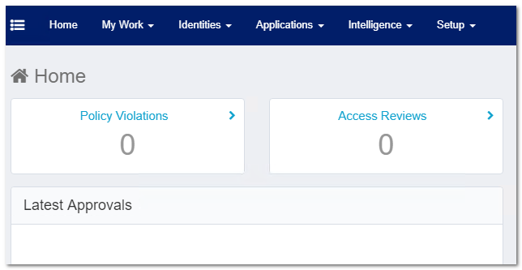
1. Navigate to __Setup__ and select the __Plugins__.

   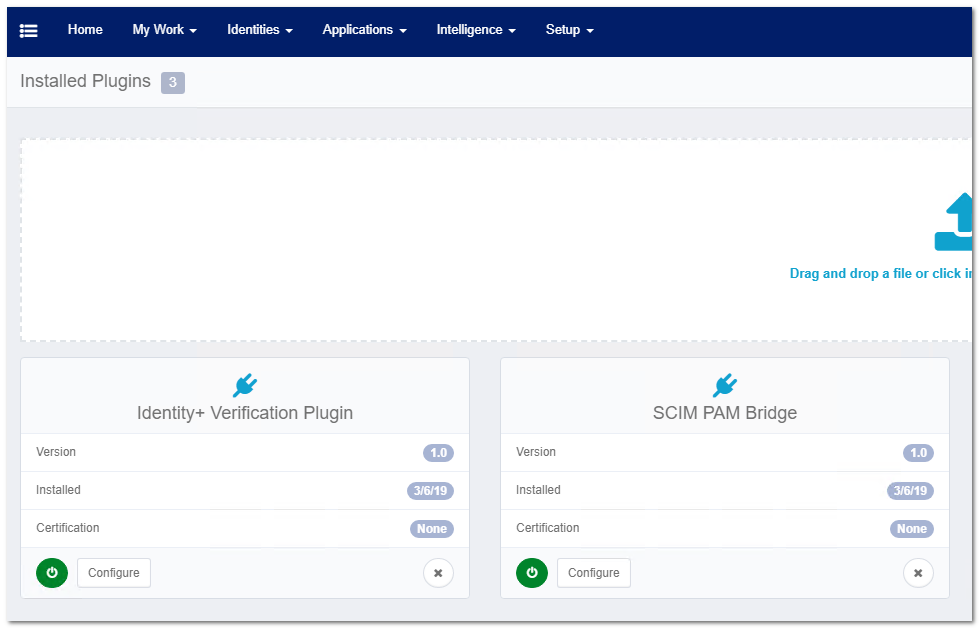
   1. Add the following plugins:

      * Identity+ Verification
      * SCIM PAM Bridge
1. Navigate to __Applications__ and select __Application Definition__.

   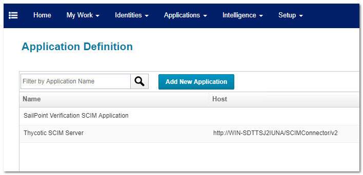
1. Click __Add New Application__.  

   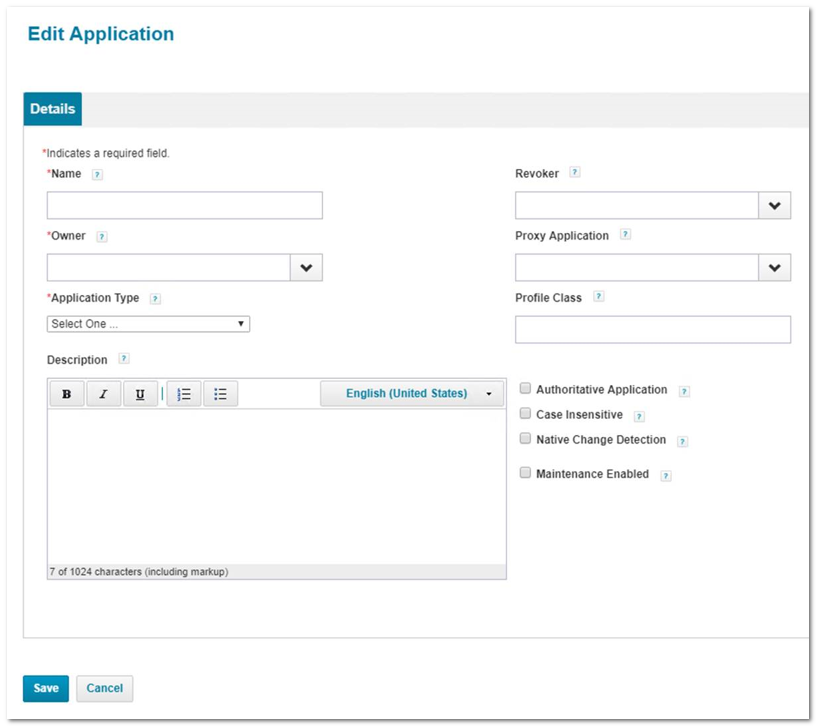
  
   Enter the following details:

   * __Name__: Enter the name for the application.
   * __Owner__: Enter the user account used to connect to the SCIM Connector application.
   * __Application Type__: Select "Privileged Account Management" from the drop-down menu.
   * Check the box for the __Authoritative application__ option
   1. Click __Save__. This takes you back to the __Application Definitions__ page.
1. Select __Configuration__.

   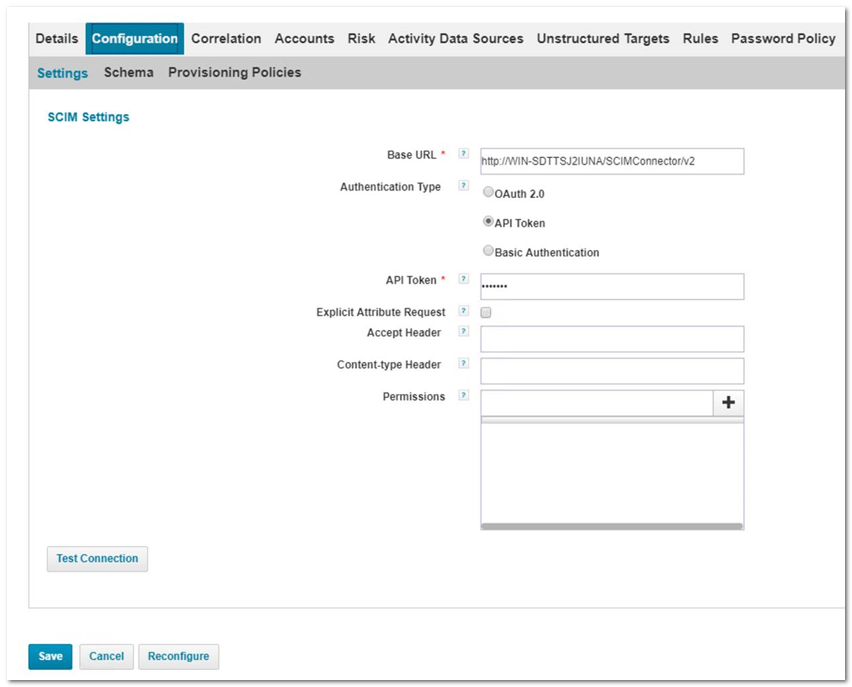

   Enter the following details:

    * __Base URL__: This should be the URL for the installed SCIM Connector application with "/v2" appended to the end of the URL.
    * __Authentication Type__: Select the __API Token__ option.
    * __API Token__: Copy and paste the API token that was generated in the SCIM Connector application when creating the SCIM endpoint (using the __Non-expiring token__ option). See [Creating the SCIM Endpoint](../../config/connect-endpoint.md).
    * __Permissions__: Click the __+__ button to the right and add __View__ permissions.

   >**Note**: We recommend you remember these values because you will need them again in a later step.
1. Once the above settings are set, click __Test Connection__ to see if the configuration works.
1. Navigate to __Configuration | Schema__.

   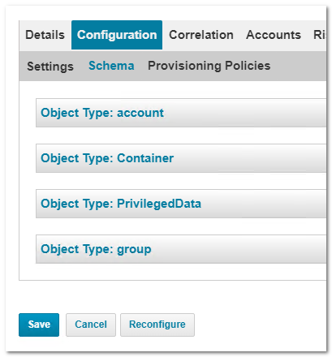
1. Open __Object Type: account__.

   
   1. Ensure the __Identity Attribute__ is set to __id__.  
   1. In the __Attributes__ section of the page, click the __Add New Schema Attribute__ button. A new attribute row appears.
   1. Add the following attribute row entries:

   | Name | Description | Type | Properties |
   | ----- | ----- | ----- | ----- |
   | source | | string | Correlation Key |
   | nativeidentifier | | string | Correlation Key |

1. Go the __Object Type: container__ section and add the following four attribute row entries:

   | Name | Description | Type | Properties |
   | ----- | ----- | ----- | ----- |
   | privilegedData.value  | The ID of the privileged data  | string | Multi-Valued |
   | privilegedData.\$ref | A URI reference to the PrivilegedData | string  | Multi-Valued |
   | privilegedData.display | The displayable value of the PrivilegedData | string | Multi-Valued |
   | privilegedData.type | The type of the PrivilegedData | string   | Multi-Valued |

1. Using the same method, go to the __Object Type: group__ section and add the following attribute rows:

   | Name | Description | Type | Properties |
   | ----- | ----- | ----- | ----- |
   | displayName | A human-readable name for the Group. REQUIRED | string   | Multi-Valued    |
   | members| A list of the members Group | | |
   | id | The unique identifier of the Group | string | |
   | source | | string | Correlation Key |
   | nativeidentifier | | string | Correlation Key |

1. Click __Save__ at the bottom of the page.
1. Return to the __Application Definition__ page.
1. Click the __Unstructured Targets__ tab.

   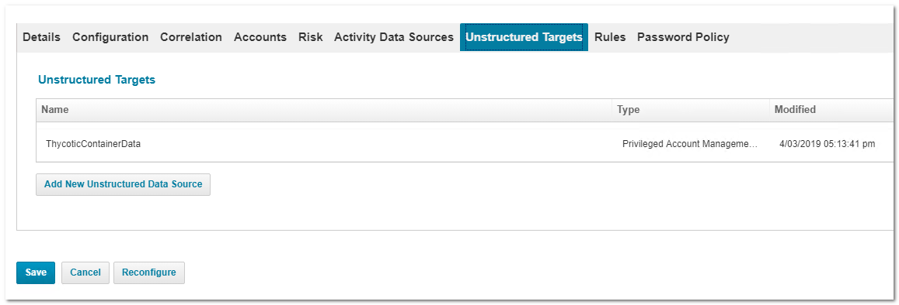
1. Click the __Add New Unstructured Data Source__ button. The Unstructured Target Configuration page appears:

   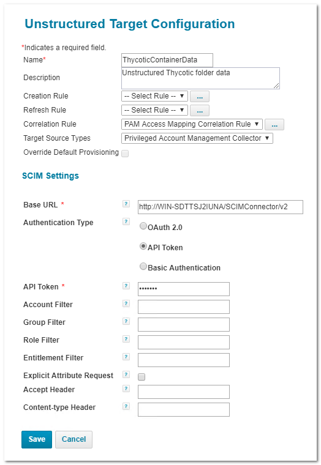
1. In the __Unstructured Target Configuration__ dialog that opens, enter the following details:
     * __Name__: Enter the name of the application that was used earlier.
     * __Description__: Enter a short description.
     * __Correlation Rule__: Select the __PAM Access Mapping Correlation Rule__ value.
     * __Target Source Types__: Select the __Privileged Account Management Collector__ value.
     * __Base URL__: Enter the same __Base URL__ value used earlier.
     * __Authentication Type__: Select the __API Token__ value.
     * __API Token__: Enter the same token that was used earlier.
1. Click __Save__.
1. On the __Application Definition__ page, select the __Correlation__ tab:

   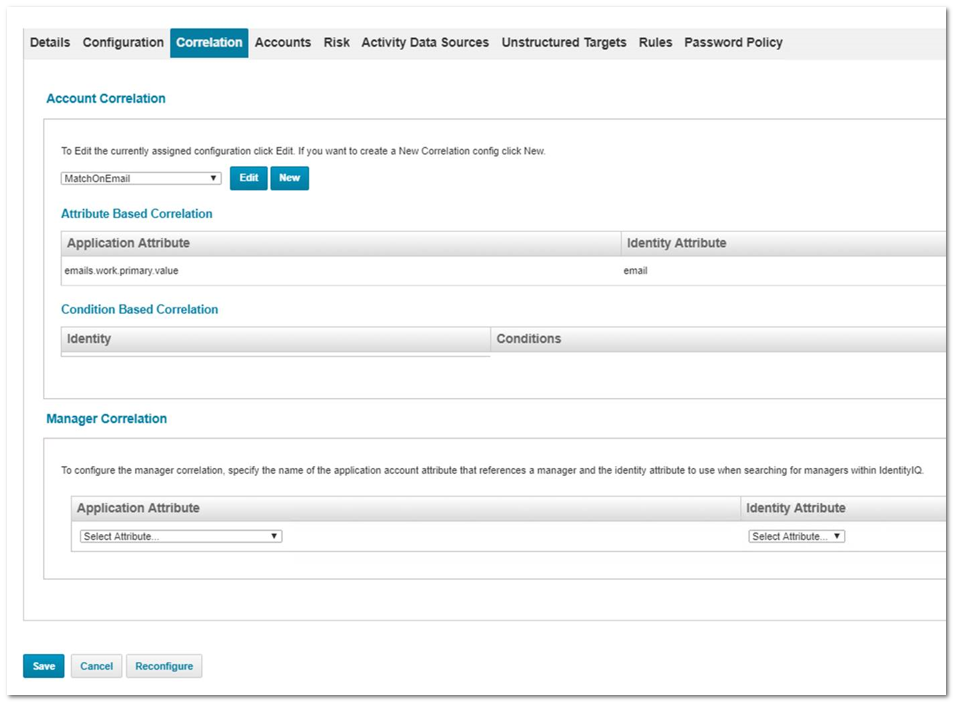
1. Add a new correlation and follow the wizard dialog that pops-up. Ensure that "email.work.primary.value" correlates to the "email" value.

   >**Note**: This correlation value __must__ be set for the integration to correctly match user values.
1. Under the Global Settings, navigate to __Identity IQ Configuration__.
1. Select the __Privileged Account Management__ tab:  

   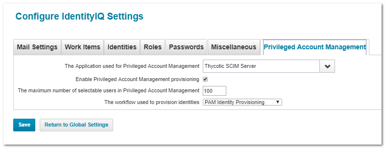

   Enter the following:
    * __The Application used for Privileged Account Management__: Set the application that was created earlier.
    * __Enable Privileged Account Management provisioning__: Enable the check box.
    * __The workflow used to provision identities__: PAM Identity Provisioning
1. Click __Save__.
1. Navigate to __Setup | Tasks__.

   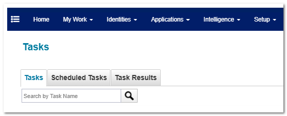
   1. Add the following tasks:

      * __Account Group Aggregation__: Select the application that was created earlier.
      * __Account Aggregation__: Select the application that was created earlier.
      * __Target Aggregation__: Select the Target source that was created.
   1. After the tasks are added, right click each task and select __Run in Background__ to execute them in the background.

   The basic configuration is now complete.
